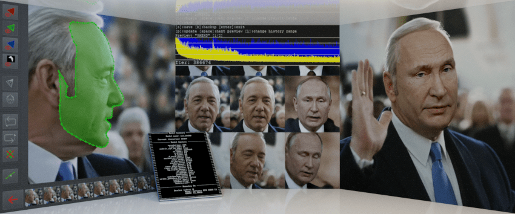

## DeepFaceLab 2.0 Deepfake 制作指南

如果您想知道如何制作 deepfake，那么您来对地方了！本 DeepFaceLab 2.0 指南将作为参考和涵盖整个过程的分步教程。DeepFaceLab 可用于各种应用，从娱乐和专业制作，到定制实施和深度学习研究。通过遵循本文档中列出的步骤和建议，您将能够使用 PC 或云计算平台创建最先进的deepfake。

英文原文地址：

https://www.deepfakevfx.com/guides/deepfacelab-2-0-guide/

___

## 目录

-   [什么是 DeepFaceLab？](https://www.deepfakevfx.com/guides/deepfacelab-2-0-guide/#what-is-deepfacelab)
-   [Deepfake 流程概述](https://www.deepfakevfx.com/guides/deepfacelab-2-0-guide/#deepfake-process-overview)
-   [DeepFaceLab 术语](https://www.deepfakevfx.com/guides/deepfacelab-2-0-guide/#deepfacelab-terminology)
-   [下载并安装 DeepFaceLab 2.0](https://www.deepfakevfx.com/guides/deepfacelab-2-0-guide/#download-install-deepfacelab)
    -   [使用哪个 DFL 版本](https://www.deepfakevfx.com/guides/deepfacelab-2-0-guide/#which-deepfacelab-version-to-use)
    -   [系统要求](https://www.deepfakevfx.com/guides/deepfacelab-2-0-guide/#system-requirements)
    -   [系统优化](https://www.deepfakevfx.com/guides/deepfacelab-2-0-guide/#system-optimization)
-   [批处理文件和文件夹](https://www.deepfakevfx.com/guides/deepfacelab-2-0-guide/#batch-files-folders)
-   [工作区概述](https://www.deepfakevfx.com/guides/deepfacelab-2-0-guide/#workspace-overview)
-   [第 1 步：清除工作区和导入数据](https://www.deepfakevfx.com/guides/deepfacelab-2-0-guide/#step-1-clear-workspace-import-data)
-   [第 2 步：从视频中提取源帧图像](https://www.deepfakevfx.com/guides/deepfacelab-2-0-guide/#step-2-extract-source-frame-images-from-video)
-   [第 3 步：从视频中提取目标帧图像](https://www.deepfakevfx.com/guides/deepfacelab-2-0-guide/#step-3-extract-destination-frame-images-from-video)
-   [第 4 步：提取源 Faceset](https://www.deepfakevfx.com/guides/deepfacelab-2-0-guide/#step-4-extract-source-faceset)
    -   [步骤 4.1：查看源 Faceset 结果](https://www.deepfakevfx.com/guides/deepfacelab-2-0-guide/#step-4-1-view-source-faceset-result)
    -   [步骤 4.2：源 Faceset 排序和清理](https://www.deepfakevfx.com/guides/deepfacelab-2-0-guide/#step-4-2-source-faceset-sortin-cleanup)
-   [第 5 步：提取目标 Faceset](https://www.deepfakevfx.com/guides/deepfacelab-2-0-guide/#step-5-extract-destination-faceset)
    -   [步骤 5.1：查看目标 Faceset 结果](https://www.deepfakevfx.com/guides/deepfacelab-2-0-guide/#step-5-1-view-destination-faceset-result)
    -   [步骤 5.2：目标 Faceset 排序、清理和重新提取](https://www.deepfakevfx.com/guides/deepfacelab-2-0-guide/#step-5-2-destination-faceset-sorting-cleanup-re-extraction)
    -   [步骤 5.3：XSeg 蒙版标记和 XSeg 模型训练](https://www.deepfakevfx.com/guides/deepfacelab-2-0-guide/#step-5-3-xseg-mask-labeling-xseg-model-training)
-   [第 6 步：Deepfake 模型训练](https://www.deepfakevfx.com/guides/deepfacelab-2-0-guide/#step-6-deepfake-model-training)
    -   [步骤 6.1：导出为 DeepFaceLive 的 DFM](https://www.deepfakevfx.com/guides/deepfacelab-2-0-guide/#step-6-1-export-as-dfm-for-deepfacelive)
-   [第 7 步：合并 Deepfake 模型以构建图像](https://www.deepfakevfx.com/guides/deepfacelab-2-0-guide/#step-7-merge-deepfake-model-to-frame-images)
-   [第 8 步：将帧图像合并到视频](https://www.deepfakevfx.com/guides/deepfacelab-2-0-guide/#step-8-merge-frame-images-to-video)
-   [第 9 步：查看结果视频](https://www.deepfakevfx.com/guides/deepfacelab-2-0-guide/#step-9-view-result-video)

___

___

DeepFaceLab (DFL) 是领先的 deepfake 创建软件。大多数高质量的 deepfakes 都是使用 DeepFaceLab 制作的。DFL 为创建 deepfakes 提供了端到端的解决方案，从数据收集和管理到模型训练和最终视频输出。

> 我们介绍了 DeepFaceLab，这是当前占主导地位的face-swapping面部替换deepfake深度伪造框架。它提供了必要的工具以及易于使用的方式来进行高质量的换脸。它还为需要在不编写复杂代码的情况下使用其他功能加强管道的人们提供了一种灵活且松散的耦合结构。我们详细介绍了推动 DeepFaceLab 实施的原则，并介绍了它的管道，通过它，用户可以轻松地修改管道的各个方面，以实现他们的定制目的。值得注意的是，DeepFaceLab 可以实现高保真影院级的效果。我们通过将我们的方法与其他人脸交换方法进行比较来展示我们系统的优势。
> 
> \-DeepFaceLab 研究团队

阅读 DeepFaceLab 白皮书了解更多信息：[DeepFaceLab：集成、灵活和可扩展的换脸框架。](https://arxiv.org/abs/2005.05535)

___

## Deepfake 流程概述

典型的 deepfake 从 2 个视频开始：一个源视频和一个目标视频。源视频包含需要换成的deepfake人脸，替换掉目标视频中的人脸。目的地是您要把 deepfake 人脸给目标视频；你想替换目标视频的脸。首先，将每个视频的各个帧转换为图像序列；然后 DeepFaceLab 可以检测每个图像中的人脸，并为每个人脸创建一个单独的文件，其中嵌入了重要的元数据；然后通过删除错误检测和其他不需要的面孔来清理这些图像集合（人脸集）；接下来，DeepFaceLab 将训练一个神经网络，根据提供的图像来学习新的 deepfake 人脸；之后，将 deepfake 人脸应用于原始目标图像，最后转换回视频。

### 什么是好的 Deepfake？

从技术上讲，DeepFaceLab 可以从几张图像中创建一个 deepfake。然而，最好的结果将来自使用具有不同面部表情和照明条件的各种高质量源图像。此外，源脸和目标脸的头部和下巴形状应该相似，这样最终的构图才会更有说服力。此外，源图像应该具有一致的特征（例如面部毛发和化妆），应该取自较短的年龄范围（几年内），并且应该与目标人脸有一些相似之处。源人脸与目标人脸越相似，deepfake 的效果就越好。从长远来看，在开始时花更多时间准备数据是最有效的方法。

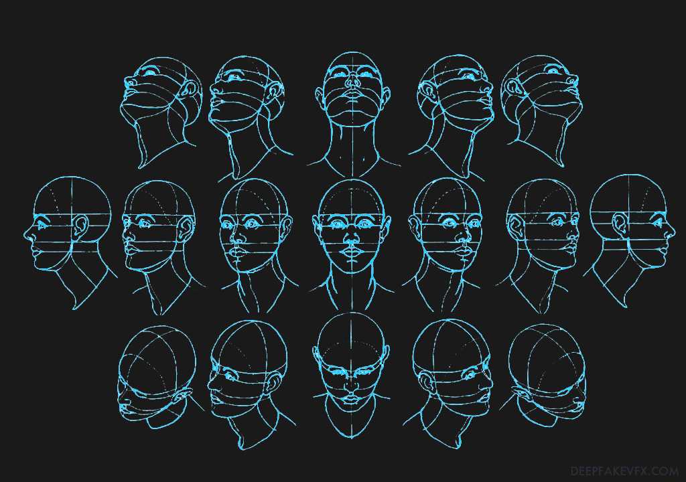

图：人头角度

创建 deepfake 必须采取许多步骤，包括几个训练阶段和几十个输入选项。虽然本指南可以推荐遵循的流程，但每个项目都是不同的，随着时间的推移，您将对软件有更深入的了解并制定自己的流程。与任何其他创意工具一样，您将通过练习更好地使用 DeepFaceLab。随意测试这些选项，看看它们对自己有什么作用，并留出一些时间来运行实验和探索新功能。

DeepFaceLab 也可以与其他图像和视频处理软件一起使用。图像增强工具、编辑和效果处理以及音频处理都有助于获得更真实的结果。

___

## DeepFaceLab 术语

为了阅读指南和使用 DeepFaceLab，您首先应该熟悉一些基本术语。

> DeepFaceLab 提供了一套工作流程，形成了灵活的管道。在 DeepFaceLab（简称 DFL）中，我们可以将 pipeline 抽象为三个阶段：提取、训练和转换。这三个部分依次呈现。此外，值得注意的是，DFL 属于典型的一对一换脸范式，这意味着只有两种数据：src 和 dst，即 source 和 destination 的缩写，用于以下叙述。
> 
> \-DeepFaceLab 开发人员

| 学期 | 描述 |
| --- | --- |
| DFL | DeepFaceLab 的缩写 |
| Build，构建 | 捆绑的 DeepFaceLab 软件（例如 RTX 3000 系列Build构建） |
| Release，发布 | 构建或代码的发布日期 |
| Workspace，工作区 | 存储所有图像、视频和其他重要文件的 /workspace 文件夹。 |
| Source来源 (SRC) | 作为视频或图像的输入数据，将放置在最终视频或图像中的面部 |
| Destination 目的(DST) | 预期的输出视频或图像，将被 deepfake 替换的面部 |
| 预测Predicted (PRD) | 创建的实际deepfake面孔 |
| Extraction萃取 | 从其他图像或视频创建图像子集的过程 |
| Landmarks标记 | 定义面部特征的点，例如眼睛、嘴巴、鼻子和下巴线 |
| Alignment 对齐 | 检测人脸并将人脸标记嵌入为图像元数据的过程 |
| Frame 帧画面 | 从视频文件中提取的图像也可以指任何照片或图像序列 |
| Faceset，人脸集或人脸集 | 从图像中提取的一组对齐的人脸 |
| Model，模型 | 定义 deepfake 神经网络的设置和文件 |
| Training，训练 | 允许神经网络根据输入数据学习预测人脸的过程 |
| Merging，合并 | 从经过训练的模型创建图像的过程，还将图像和目标声音转换为视频文件 |
| Merged Image，合并图像 | 合并过程创建的图像 |
| Result Video，结果视频 | 来自合并图像和声音的最终深度换脸视频。 |

DeepFaceLab 2.0 Deepfake 术语

___

## 下载并安装 DeepFaceLab 2.0

| Windows 版本 | 下载链接 |
| --- | --- |
| Mega.nz（最新版本） | [从 Mega.nz 下载 DeepFaceLab 2.0](https://mega.nz/folder/Po0nGQrA#dbbttiNWojCt8jzD4xYaPw/aff=HdGZWu7rIkw) |
| Torrent（最新和以前的版本） | [使用 Torrent Magnet 链接下载 DeepFaceLab](https://tinyurl.com/4vwvjuen) |

| 其他操作系统 | 下载链接 |
| --- | --- |
| 检查 DeepFaceLab GitHub 存储库 | [从 GitHub 下载 DeepFaceLab](https://github.com/iperov/DeepFaceLab) |

访问[GitHub.com/iperov/DeepFaceLab](https://github.com/iperov/DeepFaceLab)并向下滚动到标有“发布”的部分。您可以选择 torrent 磁力链接或从 mega.nz 下载。超级用户可以右键单击文件，选择下载，然后选择标准下载。

下载完成后，您可以双击 .exe 文件（自解压存档）或使用您喜欢的 zip 程序进行解压。Microsoft Defender 可能会将其作为无法识别的应用程序来阻止。这不是病毒；它是一个 zip 文件。单击“更多信息”，然后单击“仍然运行”。DeepFaceLab 没有设置。提取文件后，安装完成。

### 使用哪个 DeepFaceLab 版本

DeepFaceLab 可以与作为主要设备的独立 GPU、iGPU 或 CPU 一起使用。有多种构建（版本）可供选择，具体取决于您的系统硬件。随着软件的发展，可用的版本及其要求可能会发生变化。

| DeepFaceLab 构建 | 描述和要求 |
| --- | --- |
| DeepFaceLab NVIDIA RTX 3000 series build | 支持（并需要）NVIDIA 3000 系列 GPU。 |
| DeepFaceLab NVIDIA up to RTX 2080 TI build | 支持具有 CUDA 3.5 及更高版本的 NVIDIA GPU。请参阅[NVIDIA CUDA 计算能力指南](https://developer.nvidia.com/cuda-gpus) |
| DeepFaceLab Direct X 12 build | 与在 Windows 上运行 Direct X 12 的 AMD、Intel 和 NVIDIA 设备一起使用。支持的硬件包括 AMD Radeon R5、R7 和 R9 200 系列或更高版本、Intel HD Graphics 500 系列或更高版本以及 NVIDIA G-Force GTX 900 系列或更高版本. |
| \* 带有 AVX 指令集的 CPU \* | 标有“10) make CPU only.bat”的文件将通过安装旧版本的 TensorFlow 来修改您的软件。此更新暂时需要 Internet 连接。 |
| DeepFaceLab 1.0 OpenCL build | 此版本不再维护，许多文件和选项将与当前版本不同。 |
| 谷歌 Colab 的 DeepFaceLab | 您可以使用 Google Colab 在云中免费培训，但您可能仍需要其中一个桌面版本来准备文件。 |

DeepFaceLab 2.0 构建说明

### 系统要求

虽然除了上面列出的要求之外，官方系统要求很少，但这里有一些可能会有所帮助的一般性建议：

| 部件 | 推荐 |
| --- | --- |
| 操作系统 | Windows 10/11 或 Linux。英文键盘布局。 |
| 图形处理器 | 具有大量 VRAM 的高端 NVIDIA GPU。 |
| 中央处理器 | 至少4核CPU。 |
| 内存 | 至少 32GB。取决于其他硬件、页面文件大小和项目大小。 |
| 存储 | 用于软件和项目文件的 SSD 存储。 |
| 冷却 | 全时主动冷却，气流不受限制。 |
| 电力 | 提供足够的电力来覆盖峰值系统使用加上 30%。使用交流电源，而不是电池。禁用生态模式、系统睡眠等。 |
| ||

DeepFaceLab 2.0 系统要求

由于 DeepFaceLab 过程需要连续数小时不间断地运行机器，因此建议您不要使用笔记本电脑，除非您可以确保最佳的散热和供电。您将面临笔记本电脑的许多组件过热的风险，包括 GPU、CPU、电源和电池。

### 系统优化

| [Enable Hardware-Accelerated GPU Scheduling](https://devblogs.microsoft.com/directx/hardware-accelerated-gpu-scheduling/) | Recommended by the developer.                                |
| ------------------------------------------------------------ | ------------------------------------------------------------ |
| [Increase paging file size](https://docs.microsoft.com/en-us/windows/client-management/introduction-page-file) | Helps reduce Out of Memory (OOM) crashes.                    |
| [Disable Windows animations and effects](https://www.thewindowsclub.com/how-to-turn-on-or-off-animation-effects-in-windows) | Reduces the amount of Windows reserved VRAM. Note: May get reset to default by Windows Update. |
| [NVIDIA NVLink for multiple GP](https://www.nvidia.com/en-us/data-center/nvlink/)[U](https://www.nvidia.com/en-us/data-center/nvlink/) | Multi-GPU users report a significant performance increase.   |

DeepFaceLab 2.0 系统优化

___

## 批处理文件和文件夹

打开您提取 DeepFaceLab 的文件夹。这些是制作 deepfake 所需的所有文件和文件夹，包括 DeepFaceLab 代码、附加包和软件、工作区文件夹以及一些示例视频数据。

主文件夹中的批处理文件允许您与软件进行交互。它们按照您应该遵循的一般顺序编号，并具有描述其用途的名称。您可以将这些视为将在整个 deepfake 过程中使用的单独工具。这些文件本身并没有多大作用。相反，它们调用其他 DFL 脚本并向它们传递参数，进而初始化实际的 deepfake 进程。

\_internal 文件夹包括 DeepFaceLab 代码和其他软件以及所需的库，例如 CUDA、Python 和 FFMpeg。您可以在此处修改代码或安装 DFL 存储库的分支。

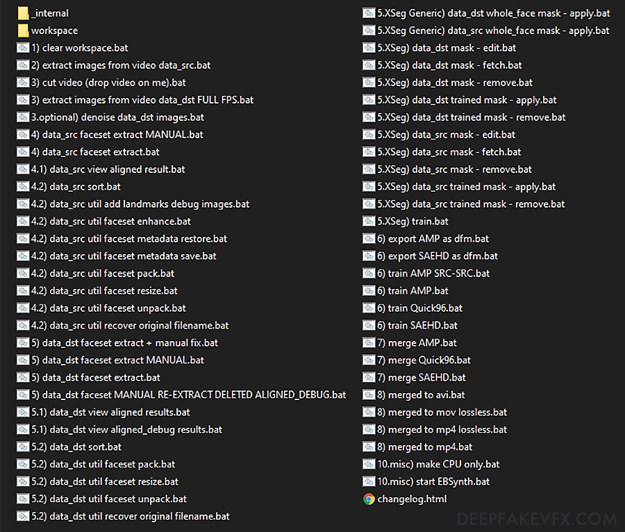

DeepFaceLab 2.0 批处理文件和文件夹

[DeepFaceLab Wiki](https://www.deepfakevfx.com/guides/deepfacelab-wiki/)包含所有批处理文件的快速参考和注释。

___

## 工作区概述

工作区文件夹是保存所有 deepfake 数据和文件的地方。工作区文件夹内还有 3 个文件夹，用于保存图像和模型文件。这2个视频文件包括data\_src（源视频）和data\_dst（目标视频）。

Data\_src 是您想要换脸的源 faceset。Data\_dst 是您要放入 deepfake 面部的目标视频（原始剪辑）。您可以使用文件名 data\_src.\* 和 data\_dst.\* 将这些文件替换为许多常见的视频文件类型。

上面提到的 DeepFaceLab 批处理脚本会期望在这些目录中找到您的文件。程序通常会根据需要创建不存在的目录。一般来说，您不应尝试移动或重命名文件夹。例如，您可以将“/aligned”文件夹的备份创建为“/aligned-copy”。您可以自由移动或重命名“/aligned-copy”文件夹；软件会忽略它。但是，如果您移动或重命名“/aligned”文件夹，那么 DeepFaceLab 将找不到它，并且您的 deepfake 将失败。此外，您应该避免使用可能被 DeepFaceLab “保留”的文件夹名称，除非它们包含预期的文件。

| 文件夹 | 描述 |
| --- | --- |
| /workspace | data\_dst.\* 和 data\_src.\* 视频文件。 |
| \-/data\_dst | 目标数据。将目标图像序列放置在此文件夹中。 |
| –/aligned | 目标 faceset 图像。将对齐的 faceset 图像放在此文件夹中。 |
| –/aligned\_debug | 生成的目标调试图像。 |
| \-/data\_src | 源数据。将源图像序列放在此文件夹中。 |
| –/aligned | 源 faceset 图像。将对齐的 faceset 图像放在此文件夹中。 |
| –/aligned\_debug | 生成的源调试图像。 |
| -/model | 模型数据。将模型文件放在此文件夹中，包括 XSeg 模型文件。 |
| –/\*\_autobackups | 生成模型文件自动备份。 |

DeepFaceLab 2.0 工作区文件夹

___

___

## 第 1 步：清除工作区和导入数据

目的：定义项目工作区。

##### 可选：1) clear workspace.bat

删除工作区子目录中的所有数据并重建文件夹结构。保留 data\_src.\* 和 data\_dst.\* 视频文件。谨慎使用。

### 导入数据

##### 使用文件名 data\_src.\* 和 data\_dst.\* 将源视频和目标视频放在工作区文件夹中

基本的 deepfake 从 2 个视频开始。您可以将自己下载的数据或文件导入以下目录。

| 数据 | 地点 |
| --- | --- |
| Video | 将源视频和目标视频放在工作区文件夹中使用文件名 data\_src.\* 和 data\_dst.\* |
|Photos、Image Sequence 照片、图像序列 | 将源图像放入 /data\_src，将目标图像放入 /data\_dst，跳到第 4 步或第 5 步 |
| Faceset | 将源对齐的人脸集放在 /data\_src/aligned，将目标对齐的人脸集放在 /data\_dst/aligned。跳到步骤 4.2 或步骤 5.2 |
|模型、XSeg 模型 | 将模型文件放入 /model |
| 预训练 Faceset | 将 faceset.pak 放入 \_internal/pretrain\_faces |
| 通用 XSeg 模型 | 将通用预训练 XSeg 模型文件放入 \_internal/model\_generic\_xseg |

DeepFaceLab 2.0 导入数据集

___

## 第2步：Extract Source Frame Images from Video

目的：为 DeepFaceLab 提供用于人脸集提取的源图像数据。

视频文件必须首先转换为图像序列。这些图像将成为源人脸集提取的目标，并且可以在步骤 4.2 之后，一旦源人脸集完成，就可以将其删除。如果您已导入自己的源照片或图像，则可以跳至步骤 3。

##### Run: 2) extract images from video data_src.bat

-   Enter FPS 输入 FPS：设置提取的帧率（频率）。  
    限制从长片段和低多样性片段中提取的帧数量。如果您的剪辑具有高度多样性或独特的帧，那么您可以通过输入“0”来提取所有帧。  
    示例：从 30 fps = 15/30 = 1/2 帧的视频中提取 15 fps。  
    \[工具提示：每秒将提取多少帧视频。0 - 完整的 fps。\]
-   Output Image Format 输出图像格式 ( png / jpg )：选择压缩的 JPEG 或未压缩的 PNG。  
    选择 png 以获得最佳图像质量。  
    \[工具提示：png 是无损的，但 HDD 的提取速度要慢 10 倍，需要比 jpg 多 10 倍的磁盘空间。\]

将处理视频文件，并为每一帧创建一个 .png 或 .jpg 文件。文件将从'00001.\*'开始枚举（例如00001.png）。按任意键或直接关闭窗口。

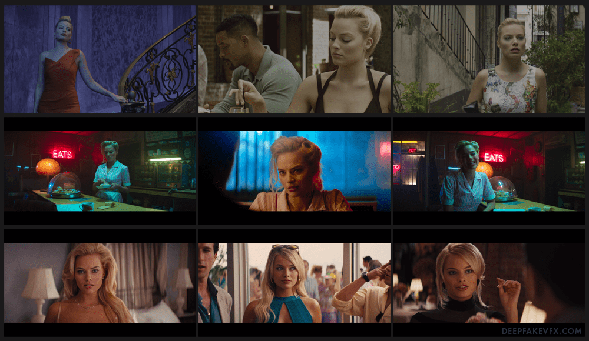

示例：DeepFaceLab 2.0 提取的图像

___

## 第3步：Extract Destination Frame Images from Video

目的：为 DeepFaceLab 提供用于人脸集提取的目标图像数据。

这些图像将成为目标 faceset 提取的目标。由于目标视频需要所有帧，因此没有用于提取的 fps 输入；将提取所有帧。目标图像将用于合并最终帧图像和视频，因此应在项目期间保留它们。如果您已导入自己的目标照片或图像序列，则可以跳至步骤 4。

##### Run: 3) extract images from video data_dst FULL FPS.bat

-   Output Image Format 输出图像格式 ( png / jpg )：选择压缩的 JPEG 或未压缩的 PNG。  
    选择 png 以获得最佳图像质量。  
    \[工具提示：png 是无损的，但 HDD 的提取速度要慢 10 倍，需要比 jpg 多 10 倍的磁盘空间。\]

将处理视频文件，并为每一帧创建一个 .png 或 .jpg 文件。将从“00001”开始枚举文件。按任意键或直接关闭窗口。

##### 可选: 3) cut video (drop video on me).bat

在提取之前，您可以修剪视频剪辑。将视频文件直接拖放到此批处理文件上以打开选项对话框。

-   From time 开始时间：编辑入点的时间码。
-   To time 结束时间：编辑出点的时间码。
-   Specify an audio track id 指定音轨 id：选择要使用的音轨。  
    检查文件以查看可用的音轨。
-   Bitrate of output file in MB 输出文件的比特率（MB/s）：设置输出文件的比特率。

新的视频文件将出现在与原始文件相同的目录中，并在文件名后附加“\_cut”。建议在剪切前将视频文件放在工作区，以免文件丢失。

##### 可选：3.optional) denoise data_dst images.bat

提取后对目标图像进行去噪。

-   Denoise facto 降噪系数（1 - 20）：设置降噪算法的值（强度）。

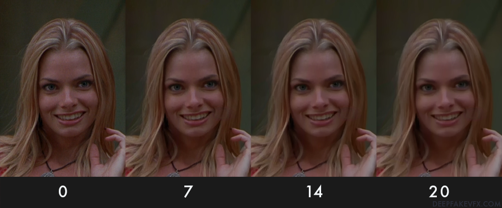

示例：DeepFaceLab 2.0 去噪比较

___

## 第4步：Extract Source Faceset

目的：为 DeepFaceLab 提供源对齐的 faceset 图像和元数据。

现在您将处理图像并提取要在 deepfake 中使用的人脸。DeepFaceLab 将检测图像中的人脸、确定人脸标志、生成默认蒙版、对齐人脸，并为每个检测到的人脸输出一个文件，包括嵌入的元数据。下图显示了面部标志的布局。

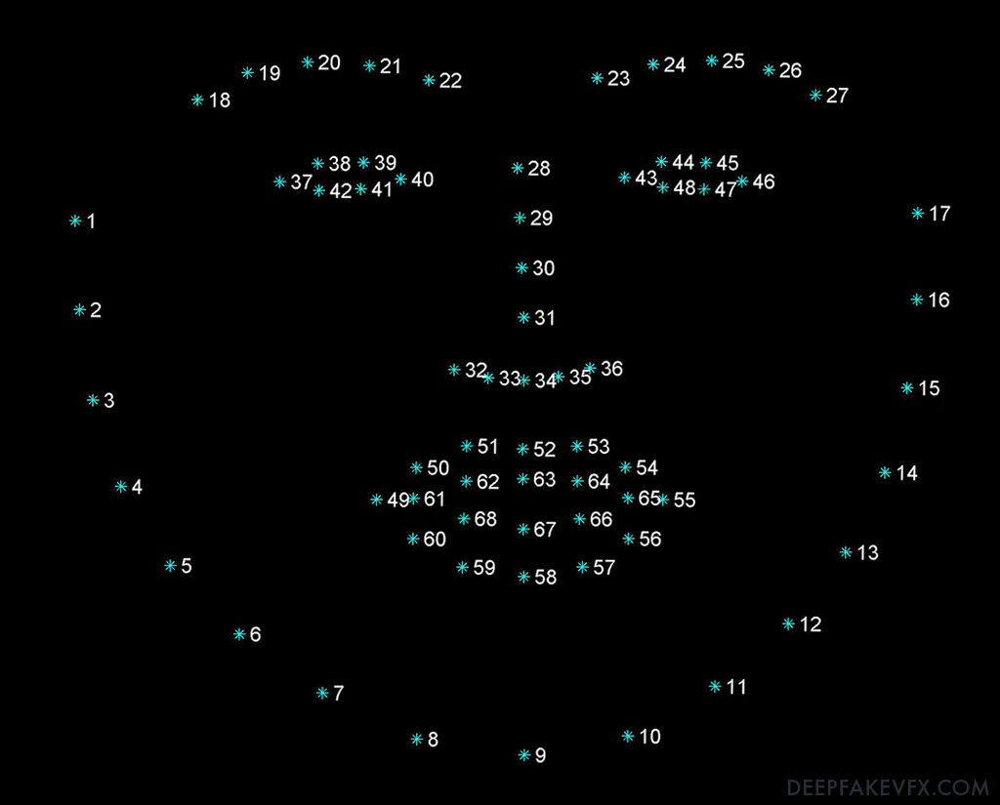

图：DeepFaceLab 2.0 人脸对齐标记

文件将根据原始（父）图像文件名命名。由于每张图像可能有不止一张脸，因此每张脸都会收到一个索引号（从 0 开始），由每个文件名的后缀表示（例如 12345\_0.jpg）。在下图中，您可以看到人脸标志（绿色）、默认蒙版（灰色）、人脸检测边界框（蓝色）、图像对齐边界框（红色）、向上方向指示器（红色三角形）以及结果示例文件名。如您所见，提取的面部集被裁剪并与红色边界框对齐。

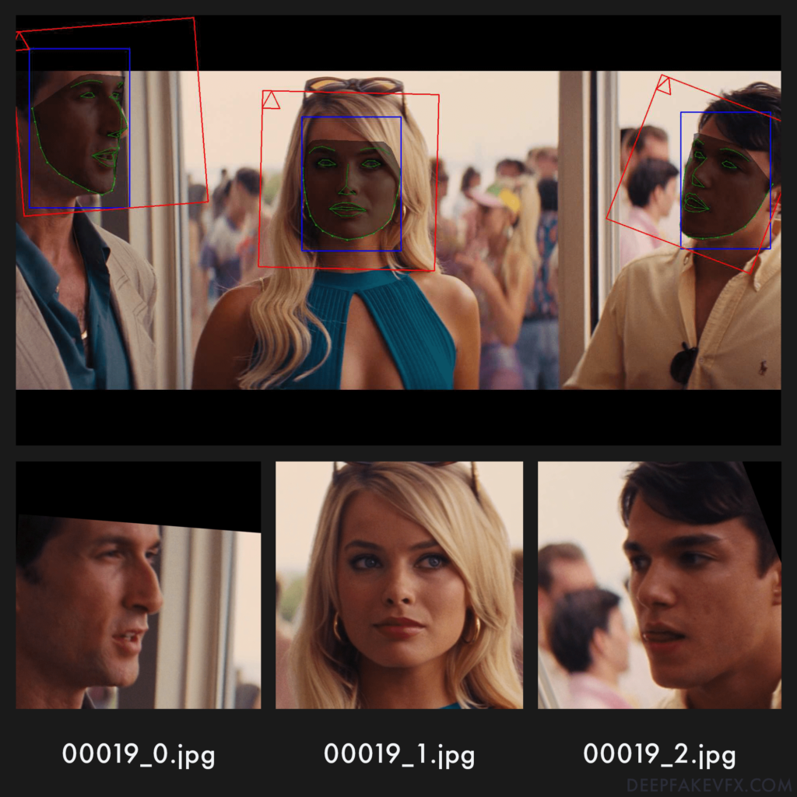

示例：DeepFaceLab 2.0 源 Faceset 索引

如果您已导入自己的源 faceset，则可以跳到第 5 步。

提取源人脸集有两种方法：自动或手动模式。自动提取器将不间断地处理所有文件，而手动提取器允许您使用键盘和鼠标输入为每个帧设置面部对齐。大多数 deepfakes 不需要手动模式，但它可用于对齐特别棘手的面部，例如极端角度、具有大量 VFX 的图像、动画角色甚至动物。

### 脸型

人脸类型是你在 deepfake 过程中必须做出的第一个关键决定，因为它决定了可以训练的人脸的最大面积。覆盖更多面部和头部的更大面部类型将产生更好的deepfake ，但是它将需要更多的系统资源、更长的训练时间、额外的蒙版和后处理。由于面部类型必须适应各种角度，一些提取的图像可能会被裁剪得更紧，而另一些则在面部周围留出更多空间。此外，较大的人脸类型可用于将模型集训练为较小的人脸类型。许多 deepfake 创作者选择 Whole Face (wf) 类型以平衡速度和相似性。

| 脸型 | 描述 |
| --- | --- |
| head | 头。覆盖整个头部和头发到颈部。使用 3D 标记。 |
| wf | 全脸。覆盖头顶至下巴以下。 |
| F | 整个脸。覆盖前额至下巴。 |
| mf | 中面（旧版）。覆盖额头至下巴。 |
| hf | 半脸（旧版）。遮住眼睛到嘴巴。 |

DeepFaceLab 2.0 人脸类型

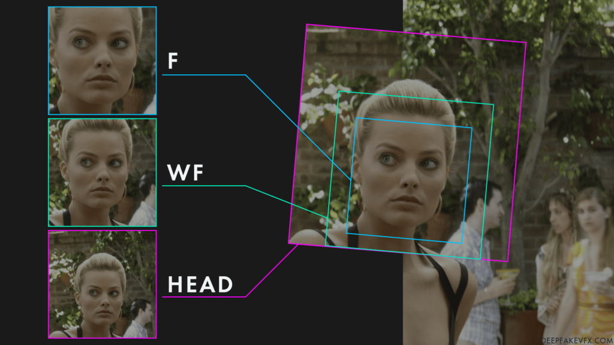

图：DeepFaceLab 2.0 人脸类型对比

在上图中，您可以看到 3 种最常见的面部类型和原始帧图像。请注意，虽然头部类型覆盖了大部分区域，但在左侧对齐的图像中，面部显得最小。您需要调整 Faceset 图像大小（分辨率）以适应面部类型和原始素材的分辨率。您还可以测量或近似帧中人脸的大小，以确定合适的图像大小。在 XSeg 蒙版期间，最重要的是，在 deepfake 模型训练期间，也需要输入面部类型。人脸类型会对训练的速度和结果的质量产生很大的影响。

##### Run: 4) data_src faceset extract.bat (Automatic)

-   Which GPU indexes to choose 要选择哪些 GPU 索引？：从列表中选择一个或多个 GPU 索引以运行提取。  
    选择多个 GPU 索引时建议使用相同的设备。
-   Face type 人脸类型（f / wf / head）：选择要提取的人脸类型。  
    \[工具提示：全脸/全脸/头部。“全脸”覆盖整个面部区域，包括前额。'head' 覆盖全头，但需要 XSeg 用于 src 和 dst faceset。\]
-   Max number of faces from image 图像中的最大人脸数：选择要从每帧中提取的最大人脸数。  
    \[工具提示：如果您提取的 src faceset 包含具有大量人脸的帧，建议将 max faces 设置为 3 以加快提取速度。0 – 无限制\]
-   Image size 图像大小（256 – 2048）：选择提取的 Faceset 图像文件的大小（分辨率）。  
    \[工具提示：输出图像大小。图像尺寸越大，面部增强器的效果就越差。仅当源图像足够清晰且无需增强人脸时才使用高于 512 的值。\]
-   Jpeg quality Jpeg 质量 (1 – 100)：选择提取的 faceset 图像文件的质量（压缩）。  
    \[工具提示：Jpeg 质量。jpeg 质量越高，输出文件越大。\]
-   Write debug images to aligned_debug 将调试图像写入aligned\_debug？( y/n )：选择是否写入调试图像。

几分钟后，提取将完成，并为您提供有关找到的图像数量和检测到的人脸的报告。源 faceset 图像文件将在 data\_src/aligned 文件夹中创建。

##### Optional: 4) data_src faceset extract MANUAL.bat

[data_src faceset extract MANUAL与4) data\_src faceset extract.bat](https://www.deepfakevfx.com/guides/deepfacelab-2-0-guide/#4-data-src-faceset-extract)相同的选项。打开一个界面以在图像上手动设置 faceset 对齐标记。手动模式每帧只允许选择一个人脸。

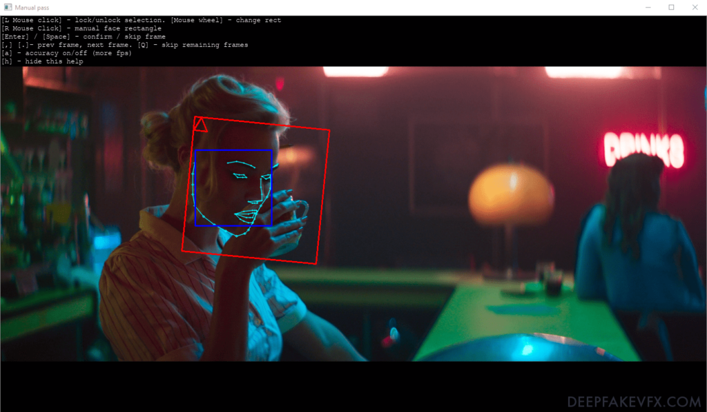

示例：DeepFaceLab 2.0 手动提取

| 输入 | 描述 |
| --- | --- |
| L 鼠标点击 | 锁定/解锁选择 |
| R 鼠标点击 | 手动脸矩形 |
| 鼠标滚轮 | 更改矩形大小 |
| Enter | 确认选择 |
| Space | 跳帧 |
| ,（逗号） | 上一帧 |
| . （period） | 下一帧 |
| Q | 跳过剩余帧 |
| A | 精度开/关（更多 fps） |
| H | 隐藏此帮助 |

DeepFaceLab 2.0 手动提取键盘输入

___

## 步骤 4.1：查看源 Faceset 结果

提取后，您可以使用随附的 XNView 图像查看器查看源 Faceset 结果。

##### 运行：4.1) data_src view aligned result.bat

源 faceset 将使用附带的 XNView 图像查看器打开。您还可以在 data\_src/aligned 文件夹中找到这些文件。您会注意到图像按顺序编号，并带有包含下划线和数字的后缀。DeepFaceLab 根据原始图像编号和图片中人脸的索引为每个文件命名。第一张脸，由 \_0 后缀表示，通常是父帧图像中最大的脸。

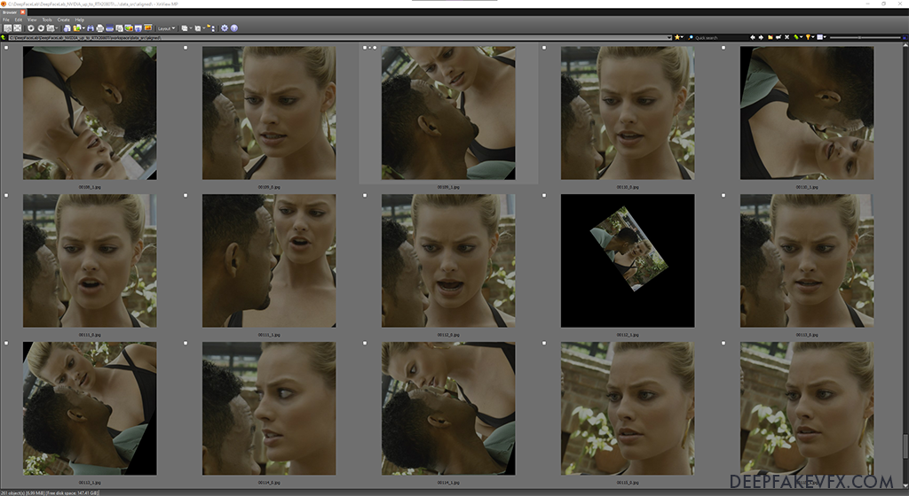

示例：DeepFaceLab 2.0 XNView 图像查看器

##### 按索引删除不需要的面孔

如果您没有限制每张图像的最大面部数量，那么提取器可能会产生大量不需要的面部提取和错误检测。

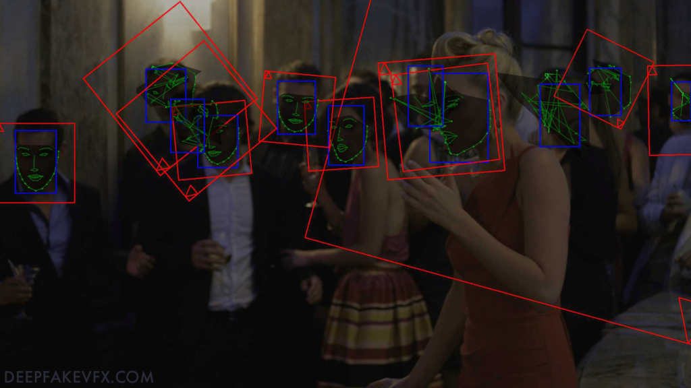

示例：DeepFaceLab 2.0 多面调试图像

##### Source Faceset Raw Extraction Samples:

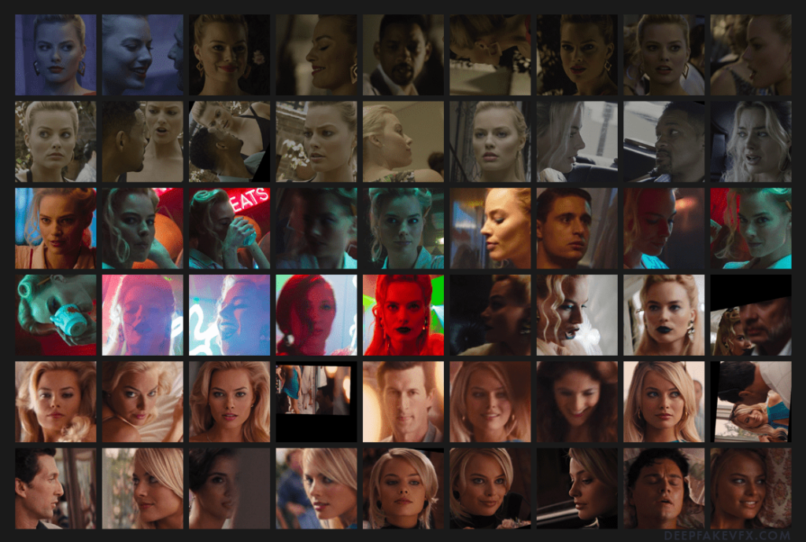

示例：DeepFaceLab 2.0 在清理之前提取的 Faceset

使用 XNView 或导航到 data\_src/aligned 文件夹，您可以开始删除不需要的面。由于源人脸可能是第一个或第二个图像索引，因此您可以快速删除其他人的人脸。在搜索栏中开始输入“\_0.jpg”。这将向您显示在每个帧图像中检测到的第一张脸。删除任何不需要的面孔和错误检测。您还可以开始移除高度旋转或缩放的面以及源面的极端障碍物。现在搜索“\_1.jpg”并从下一个人脸索引中删除所有不需要的图像，重复该过程直到到达最后一个人脸索引。清除搜索框并再次查看整个面部集，以查找您可能错过的任何不需要的图像。

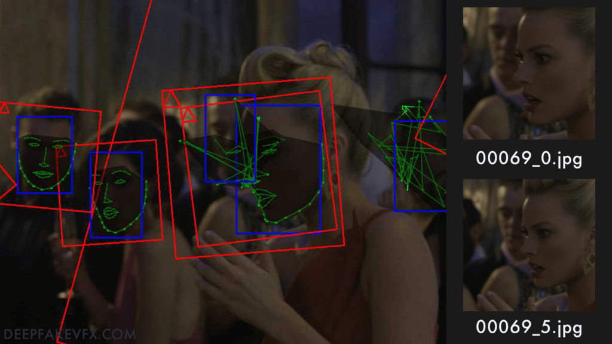

示例：DeepFaceLab 2.0 源 Faceset 重复检测

请注意可能的重复或错位的面部提取。 在上图中，您可以看到已提取了 2 个相似的人脸。 虽然人脸边界框（蓝色）找到了 2 个不同的人脸，但特征对齐（绿色）被遮挡，这导致图像边界框（红色）定位到错误的人脸。 在这种情况下，应保留第一个图像（索引 \_0）。 如果您不确定哪张脸是正确的，您应该简单地删除它们。

___

## Step 4.2: Source Faceset Sorting & Cleanup

目的：整理源输入数据。

人脸集提取器将从原始图像中导出许多面部，并且可能包括错误检测、对齐不良的面部和重复图像。源人脸集清理的目标是产生一个准确对齐的主题的人脸集，具有高度的多样性和很少的重复。由于您可能会拥有大量源图像，因此请随意删除您不确定的任何面孔。您还应该修剪源人脸集以适合目标人脸集角度、表达式和颜色。提取目标 faceset 后重新访问此部分。

##### 清理和修剪后的源人脸集：

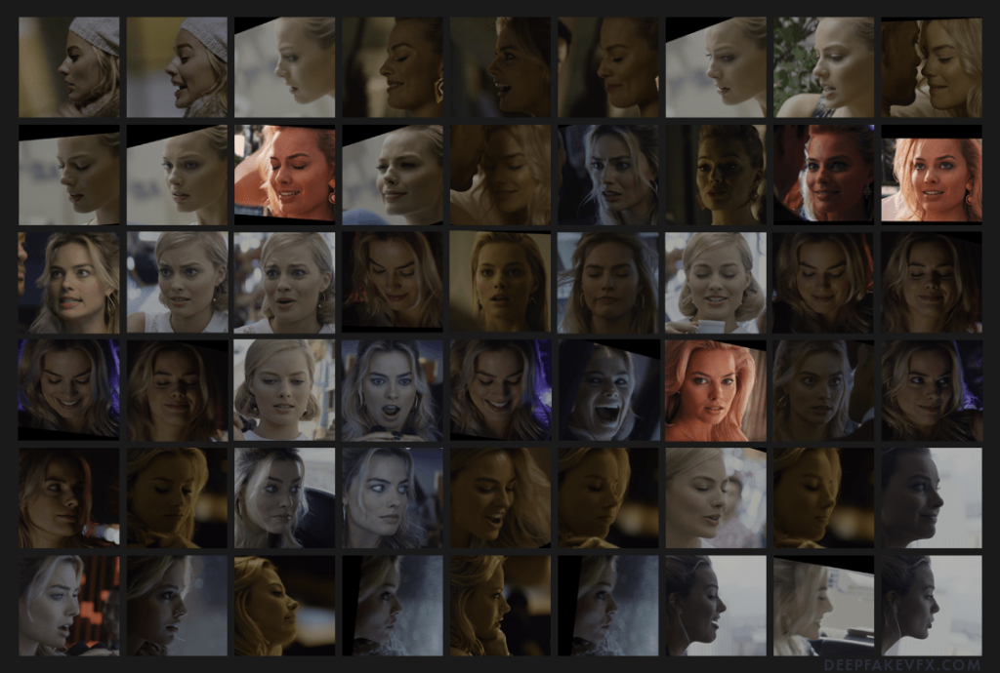

示例：DeepFaceLab 2.0 清理后提取的 Faceset

##### 运行：4.2）data\_src sort.bat

有许多不同的排序方法可供选择。按直方图相似度排序会将相似的图像组合在一起，帮助您批量删除不需要的面孔和极其相似的图像。按间距排序和按偏航排序将帮助您找出错误的对齐方式。按模糊排序允许您删除低质量的图像。

这些排序方法将按照新顺序重命名文件。运行文件 '4.2) data\_src util restore original filename' 将使文件恢复其原始名称和顺序。唯一的例外是按最佳面孔和最佳面孔更快地排序。这两种方法将要求您输入所需数量的图像，从中选择具有不同属性的各种面孔。其余图像将移至“aligned\_trash”文件夹。最好的面孔排序不是很准确，所以不要仅仅依靠它来创建你的人脸集。

| 排序方法 | 描述 |
| --- | --- |
| \[0\] blur 模糊 | 根据对比度按图像模糊度排序。 |
| \[1\] motion blur 运动模糊 | 按运动模糊排序。 |
| \[2\] face yaw direction 面向偏航方向 | 按偏航（水平/从左到右）排序。 |
| \[3\] face pitch direction 面俯仰方向 | 按间距排序（垂直/从上到下）。 |
| \[4\] face rect size in source image 源图像中的人脸矩形大小 | 按原始视频帧图像中的人脸大小排序（降序）。 |
| \[5\] histogram similarity 直方图相似度 | 按直方图相似度（降序）排序。 |
| \[6\] histogram dissimilarity 直方图相异 | 按直方图相似度（升序）排序。 |
| \[7\] brightness 亮度 | 按图像亮度排序。 |
| \[8\] hue 色调 | 按图像色调排序。 |
| \[9\] amount of black pixels 黑色像素数量 | 按图像中黑色像素的数量排序（升序）。 |
| \[10\]original filename 原始文件名 | 按原始文件名的顺序排序。不恢复原始文件名。 |
| \[11\]  one face in image 图像中的一张脸 | 按原始视频帧图像中的人脸数量排序（升序）。 |
| \[12\] absolute pixel difference 绝对像素差 | 按绝对差排序。 |
| \[13\] best faces 最好的面孔 | 按多种方法（带模糊）排序并删除相似的面孔。选择要保留的人脸图像的目标数量。丢弃的面移至 data\_src/aligned\_trash。 |
| ||
| \[14\] best faces faster 最好的面孔更快 | 按多种方法排序（w/face rect size）并删除相似的面孔。选择要保留的人脸图像的目标数量。丢弃的面移至 data\_src/aligned\_trash。 |
| ||

DeepFaceLab 2.0 排序方法

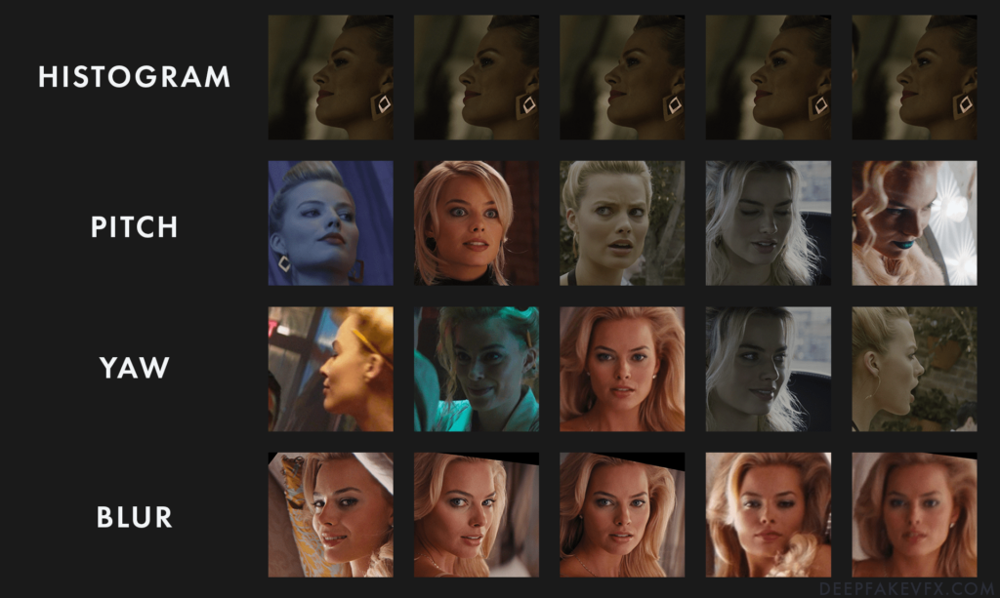

示例：DeepFaceLab 2.0 排序方法

### Data\_src 实用程序

有几个实用程序可以帮助您处理源图像。

| Data\_src 实用程序 | 描述 |
| --- | --- |
| 4.2) data_src util add landmarks debug images.bat | 添加人脸标记调试图像。 复制 data\_src/aligned 中的 faceset 图像。 为图像添加可见的标记。 将“\_debug”附加到文件名。 注意：在训练之前从 faceset 中删除调试图像。 |
| 4.2) data\_src util faceset enhance.bat | 通过高档增强源人脸集。 将在 data\_src/aligned\_enhanced 中创建增强图像。 系统将询问您是否要替换（覆盖）原始图像。 |
| 4.2) data\_src util faceset metadata restore.bat | 从 meta.dat 文件恢复源 faceset 元数据。 |
| 4.2) data\_src util faceset metadata save.bat | 将源 faceset 元数据保存为 meta.dat 文件。 \[控制台：现在您可以编辑图像了。！！！在文件夹中保留相同的文件名。 您可以更改图像的大小，恢复过程将缩小到原始大小。 之后，使用恢复元数据。\] |
| 4.2) data\_src util faceset pack.bat | 将源 faceset 打包为 data\_src/aligned/faceset.pak 文件。系统将询问您是否要删除原始文件。 |
| 4.2) data\_src util faceset resize.bat | 调整和更改源 Faceset 图像的面部类型。\[注：半脸/中脸/全脸/全脸/头部/无变化\]调整大小的图像将在data\_src/aligned\_resized中创建。系统将询问您是否要替换（覆盖）原始图像。 |
| 4.2) data\_src util faceset unpack.bat | 解压源 data\_src/aligned/faceset.pak 文件。Faceset.pak 将被删除。 |
| 4.2) data_src util recover original filename.bat | 排序后用原始文件名重命名源 Faceset 文件。Faceset 文件名取自原始视频帧图像文件名。 |
| ||

DeepFaceLab 2.0 源实用程序

___

## 第五步：Extract Destination Faceset

目的：为 DeepFaceLab 提供目标对齐的 faceset 图像。

目标人脸集提取过程类似于源人脸集的提取过程。如果您已导入自己的目标 faceset，则可以跳到步骤 5.3。

##### 运行: 5) data_dst faceset extract.bat

-   Which GPU indexes to choose?: Select one or more GPU indexes from the list to run extraction. 要选择哪些 GPU 索引？：从列表中选择一个或多个 GPU 索引以运行提取。  
    选择多个 GPU 索引时建议使用相同的设备。
-   Face type ( f / wf / head ): Select the face type for the extraction.人脸类型（f / wf / head）：选择要提取的人脸类型。  
    \[工具提示：全脸/全脸/头部。“全脸”覆盖整个面部区域，包括前额。'head' 覆盖全头，但需要 XSeg 用于 src 和 dst faceset。\]
-   Image size ( 256 – 2048 ): Select the size (resolution) of the extracted faceset image files. 图像大小（256 – 2048）：选择提取的 Faceset 图像文件的大小（分辨率）。  
    \[工具提示：输出图像大小。图像尺寸越大，面部增强器的效果就越差。仅当源图像足够清晰且无需增强人脸时才使用高于 512 的值。\]
-   Jpeg quality ( 1 – 100 ): Select the quality (compression) of the extracted faceset image files.Jpeg 质量 (1 – 100)：选择提取的 faceset 图像文件的质量（压缩）。  
    \[工具提示：Jpeg 质量。jpeg 质量越高，输出文件越大。\]

几分钟后，提取将完成，并为您提供有关找到的图像数量和检测到的人脸的报告。目标 faceset 图像文件将在 data\_src/aligned 文件夹中创建。调试图像也将在 data\_dst/aligned\_debug 文件夹中生成。

##### Optional: 5) data_dst faceset extract MANUAL.bat

手动目标人脸集提取器采用与 5) data_dst faceset extract.bat 相同的选项。 打开一个界面以在图像上手动设置 faceset 对齐标记。 手动模式每帧只允许选择一个人脸。

##### Optional: 5) data_dst faceset extract + manual fix.bat

手动修复的目标人脸集提取器采用与 5) data\_dst faceset extract.bat。 自动目标人脸集提取器，可选择手动标记未检测到的帧。 自动提取后将打开一个界面，允许您在未检测到人脸的视频帧上手动设置人脸对齐标记。 手动模式允许每帧选择一个人脸。

### Manual Re-Extract Faces

您可以手动重新提取对齐不佳或未检测到的人脸。 删除不需要的面孔后，您可能需要重新访问此步骤。

首先，通过运行 [5.1) data\_dst view aligned\_debug results.bat](https://www.deepfakevfx.com/guides/deepfacelab-2-0-guide/# 5-1-数据-dst-view-aligned-debug-result)。 删除包含您想要包含在目标人脸集中的未正确对齐或未检测到的人脸的任何图像。 接下来，您将仅从已删除的帧中手动重新提取人脸。 由于您只能在手动模式下选择一个人脸，因此该图像将收到 \_0 的索引，并将覆盖该帧和人脸索引的当前对齐图像。 该帧具有任何其他索引的对齐图像将保留。 虽然不是必需的，但在删除调试图像时也删除相应的对齐图像可能会有所帮助。

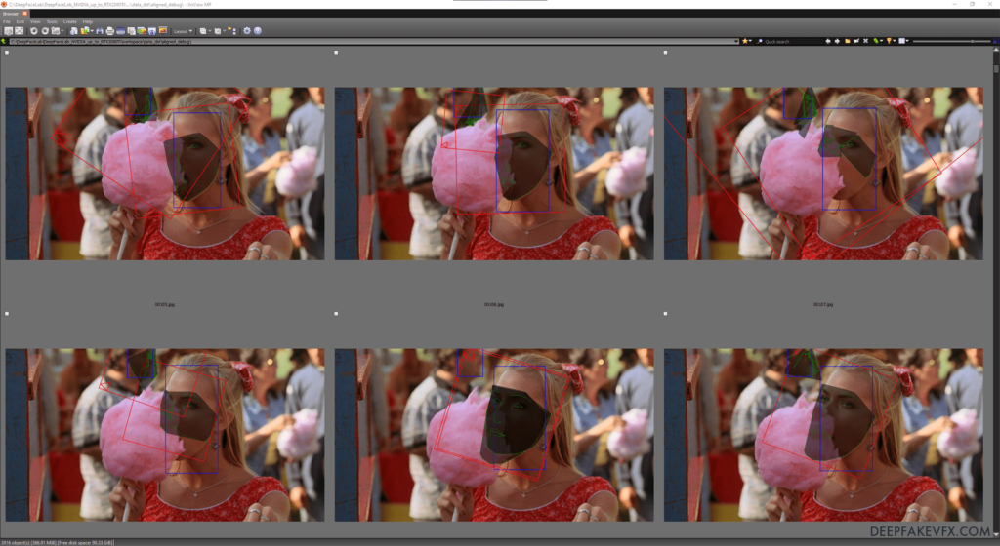

示例：DeepFaceLab 2.0 Data\_dst 视图对齐调试

打开一个界面以手动设置与已删除调试图像相对应的视频帧上的 faceset 对齐标记。

-   Which GPU indexes to choose? 要选择哪些 GPU 索引？：从列表中选择一个或多个 GPU 索引以运行提取。  
    选择多个 GPU 索引时建议使用相同的设备。
-   Image size ( 256 – 2048 ) 图像大小（256 – 2048）：选择提取的 Faceset 图像文件的大小（分辨率）。  
    \[工具提示：输出图像大小。图像尺寸越大，面部增强器的效果就越差。仅当源图像足够清晰且无需增强人脸时才使用高于 512 的值。\]
-   Jpeg quality ( 1 – 100 ) Jpeg 质量 (1 – 100)：选择提取的 faceset 图像文件的质量（压缩）。  
    \[工具提示：Jpeg 质量。jpeg 质量越高，输出文件越大。\]

接口和流程同[4) data\_src faceset extract manual](https://www.deepfakevfx.com/guides/deepfacelab-2-0-guide/#4-data-src-faceset-extract-manual)。您将无法更改面部类型。控制台将记录找到的图像数量和检测到的人脸。

___

## 步骤 5.1：查看目标 Faceset 结果

提取后，您可以查看目标人脸集。

##### Run: 5.1) data_dst view aligned results.bat

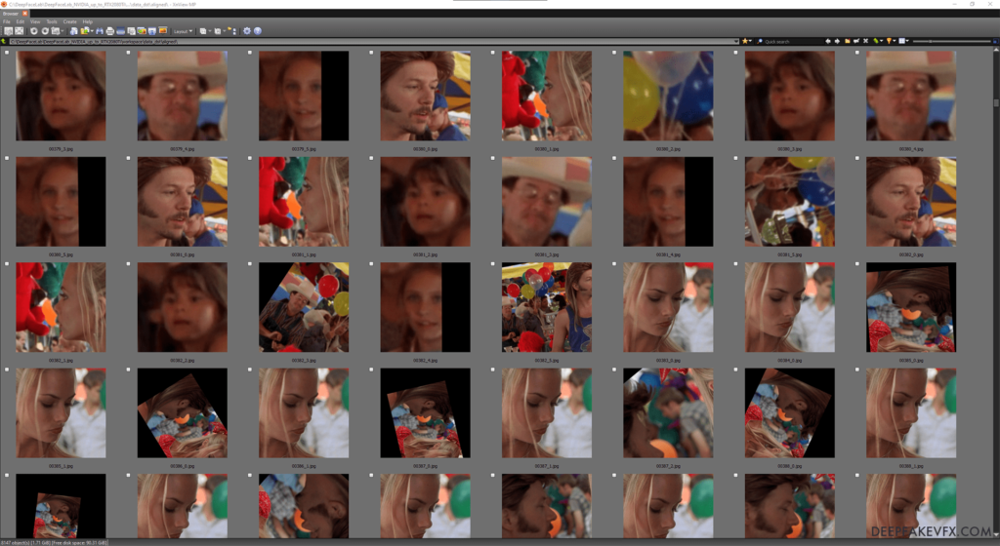

示例：DeepFaceLab 2.0 目标人脸集

##### 按索引删除不需要的面孔

参考[Step 4.1: View Source Faceset Result](https://www.deepfakevfx.com/guides/deepfacelab-2-0-guide/#step-4-1-view-source-faceset-result) 中的索引搜索方法获取说明。 尽量保留尽可能多的目标 faceset 图像。 首先删除其他人的面孔和错误检测。 稍后您可以参考调试图像来删除和修复错误的对齐方式。

同样，请注意可能的重复和错位的面部提取。 由于您想保留尽可能多的目标面孔，因此您必须小心确定要保留哪些面孔以及要删除哪些面孔。 在下图中，您可以看到已提取了 2 个相似的人脸。 虽然人脸边界框（蓝色）找到了 2 个不同的人脸，但特征对齐（绿色）被遮挡，这导致图像边界框（红色）定位到错误的人脸。 使用调试图像来确定哪个是理想的脸。

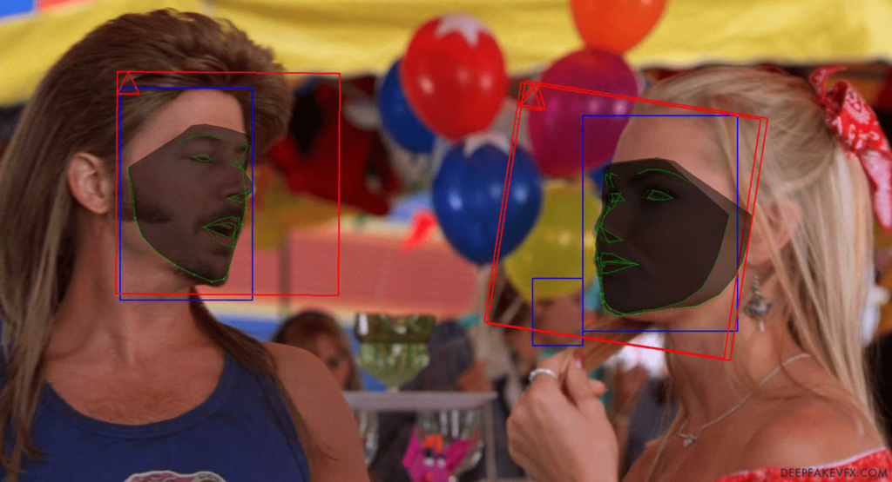

示例：DeepFaceLab 2.0 重复人脸检测

##### 可选：5.1) data_dst view aligned_debug results.bat

在 XNView 中打开目标对齐调试图像。使用此图像查看器可查找对齐不佳的相应 faceset 图像。

在运行[5) data\_dst faceset MANUAL RE-EXTRACT DELETED ALIGNED\_DEBUG 之前](https://www.deepfakevfx.com/guides/deepfacelab-2-0-guide/#5-data-dst-faceset-manual-re-extract)，使用此查看器删除包含对齐不佳的面的调试图像。

___

## Step 5.2: Destination Faceset Sorting, Cleanup & Re-Extraction

目的：整理目的人脸集输入数据。

##### 运行：5.2）data\_dst sort.bat

有关基本说明，请参阅[Step 4.2: Source Faceset Sorting & Cleanup](https://www.deepfakevfx.com/guides/deepfacelab-2-0-guide/#4-data-src-sort)中的排序方法。

对于目标 faceset，您希望保留尽可能多的人脸图像，因为任何被删除的人脸都不会出现在最终的 deepfake 中。

### Data\_dst 实用程序

有一些实用程序可以帮助您进行目标图像处理。

| data\_dst 实用程序 | 描述 |
| --- | --- |
| 4.2) data\_dst util faceset pack.bat | 将目标 faceset 打包为 data\_dst/aligned/faceset.pak 文件。 删除原始文件？( y / n ) : 选择打包后删除原始文件。 |
| 4.2) data\_dst util faceset resize.bat | 调整和更改目标 Faceset 图像的面部类型。调整大小的图像将在 data\_dst/aligned\_resized 中创建。 新图像尺寸 (128-2048)：选择新的 faceset 图像尺寸（分辨率）。 更改面型（h / mf / f / wf / head / same）：选择以更改面型。\[注：半脸/中脸/全脸/全脸/头部/无变化\] Merge data\_src/aligned\_resized to data\_src/aligned ?：选择用调整大小的图像替换（覆盖）原始面部图像。 |
| 4.2) data\_dst util faceset unpack.bat | 解压目标 data\_dst/aligned/faceset.pak 文件。Faceset.pak 将被删除。 |
| 4.2) data\_dst util 恢复原始文件名.bat | 排序后用原始文件名重命名目标 Faceset 文件。Faceset 文件名取自原始视频帧图像文件名。 |

DeepFaceLab 2.0 目标实用程序

___

___

## 步骤 5.3：XSeg 蒙版标记和 XSeg 模型训练

目的：为模型训练和合并定义 faceset mask 区域。

每个人脸都将包含一个在提取过程中生成的默认蒙版。创建 Xseg 蒙版允许您指定将或不会训练面部的哪些区域，并定义用于合并的蒙版形状。使用 XSeg 将产生更好的构图并增加与源 faceset 的相似度。XSeg 蒙版还将帮助模型确定面部尺寸和特征，从而产生更逼真的眼睛和嘴巴运动。虽然默认蒙版可能对较小的面部类型有用，但较大的面部类型（例如全脸和头部）需要自定义 XSeg 蒙版才能获得最佳效果。Xseg 蒙版还允许您排除手、头发、眼镜、穿孔等障碍物。

### XSeg 实用程序

在开始使用 XSeg 之前，请阅读此表，其中列出了可用的各种工具。

| XSeg 实用程序 | 描述 |
| --- | --- |
| 5.XSeg Generic) data\_dst Whole\_face mask – apply.bat | 将通用 XSeg 整体面罩应用于目标人脸集。 |
| 5.XSeg Generic) data\_src whole\_face mask – apply.bat | 将通用 XSeg 整体面罩应用于源人脸集。 |
| 5.XSeg) data_dst mask – edit.bat | 编辑目标 XSeg 蒙版标签。 |
| 5.XSeg) data_dst mask – fetch.bat | 将 XSeg 标记的目标 faceset 图像复制到 data\_dst/aligned\_xseg。 |
| 5.XSeg) data_dst mask – remove.bat | 从目标 faceset 图像中删除 XSeg 蒙版标签。 |
| 5.XSeg) data_dst trained mask – apply.bat | 将经过训练的 XSeg 蒙版应用于目标人脸集。 |
| 5.XSeg) data_dst trained mask – remove.bat | 从目标 faceset 中删除经过训练的 XSeg 蒙版。 |
| 5.XSeg) data_src mask – edit.bat | 编辑源 XSeg 蒙版标签。 |
| 5.XSeg) data_src mask – fetch.bat | 将 XSeg 标记的源 faceset 图像复制到 data\_src/aligned\_xseg。 |
| 5.XSeg) data_src mask – remove.bat | 从源人脸集图像中删除 XSeg 蒙版标签。 |
| 5.XSeg) data_src trained mask – apply.bat | 将经过训练的 XSeg 蒙版应用于源人脸集。 |
| 5.XSeg) data_src trained mask – remove.bat | 从源人脸集中删除训练有素的 XSeg 蒙版。 |
| 5.XSeg）train.bat | 使用来自源人脸集和目标人脸集的标记图像训练 XSeg 蒙版。 |

DeepFaceLab 2.0 XSeg 实用程序

### 快速入门：通用 XSeg 预训练蒙版

开始使用 Xseg 的最快方法是应用预训练蒙版。DeepFaceLab 包括一个通用的全脸 Xseg 蒙版。您还可以自己预训练或下载预训练的蒙版。通用封装文件可以在 \_internal/model\_generic\_xseg 文件夹中找到。请记住，这是全脸型面罩，可能不适用于其他脸型。

##### 可选：5.XSeg Generic) data_dst whole face mask apply.bat

-   选择哪个 GPU 索引？：从列表中选择一个 GPU 索引以应用 XSeg 蒙版。

通用整体面罩将应用于目标人脸集。将通用训练的 XSeg 模型文件放在 \_internal/model\_generic\_xseg 中。

##### 可选：5.XSeg Generic) data_src whole face mask apply.bat

-   选择哪个 GPU 索引？：从列表中选择一个 GPU 索引以应用 XSeg 蒙版。

通用整体面罩将应用于源人脸集。您可以在 \_internal/model\_generic\_xseg 中找到通用的预训练 XSeg 模型文件。

示例：已应用 DeepFaceLab 2.0 Generic XSeg Mask

如果您开始或继续在应用通用蒙版的情况下训练 deepfake，您会注意到开始形成更大的蒙版区域。 模型需要一些时间来适应遮罩。 这个通用蒙版是许多项目的一个很好的起点，但是对于极端角度和黑暗、模糊或严重受阻的面孔可能会遇到困难。

### Labeling XSeg Masks

要创建自己的 Xseg 蒙版，您首先需要使用蒙版多边形标记一些面。 之后，您将训练并将遮罩应用到 faceset。

##### Run 5.XSeg) data\_dst mask edit.bat

您将看到 Xseg 启动屏幕，并且一旦加载图像，您将能够使用该界面。 首先让我们回顾一下 XSeg UI。

Diagram: DeepFaceLab 2.0 XSeg Masking Interface

首先标记一些清晰、完全暴露且没有遮挡的更容易的面孔。 选择一个舒适的起点和方向来围绕面部工作。 使用鼠标左键沿面边缘放置点。 鼠标滚轮将允许您放大和缩小，将图像重新居中在光标上。 使用 Ctrl + Z 撤消以前的点。

完成面部标记后，按 A 或 D 键或使用箭头保存并移至另一帧。 然后，您可以滚动回框架并通过移动、添加或删除点来修改多边形。

无需专注于制作具有数百个点的精确蒙版；几十个就可以了。相反，花时间在 Faceset 偏航、俯仰和颜色范围内标记各种面。您还应该标记各种面部表情，例如张开和闭合的嘴巴，以及注视不同方向的眼睛。您可以关闭编辑器并使用排序工具对图像重新排序，确保您有良好的标记面分布。通常，您标记的图像越多，遮罩效果就越好。

##### 运行 5.XSeg) data\_src mask edit.bat

建议您在源人脸集中和目标人脸集中至少标记几十个面。对于复杂的深度伪造，您应该期望标记 100 个或更多的面孔。

### 障碍与排除

面部前方的障碍物可以排除在遮罩区域之外。第一种方法是简单地在障碍物的边缘绘制遮罩。第二种方法是以排除模式在对象周围绘制蒙版。按 W 键或单击图标切换到排除模式并在对象周围绘制多边形。重要的是要记住，在使用排除模式时，您还必须在脸部周围绘制一个包含蒙版。请勿仅使用排除蒙版标记面部。按 Q 键或使用图标切换回包含模式。如果可能，您还应该在各种框架上标记障碍物。

请记住，您对蒙版形状所做的任何更改都可能会影响 deepfake 面部的训练和合并。您可能需要在训练期间采取额外的步骤，以确保排除的障碍不会使面部变形。为获得最佳效果，您应该使用后处理软件处理这些障碍物。

### 获取和删除

标记脸部后，您可以创建标记图像文件的备份。

##### 运行：5.XSeg) data\_dst mask\_fetch.bat

-   Delete original files? ( y / n ) 删除原始文件？( y / n ) ：选择在提取后从 faceset 中删除带有 Xseg 标记的文件。

这会将所有带有 XSeg 标记的目标文件复制到 data\_dst/aligned\_xseg，并且系统会询问您是否要删除原始文件。

##### 运行：5.XSeg) data\_src mask\_fetch.bat

-   Delete original files? ( y / n ) 删除原始文件？( y / n ) ：选择在提取后从 faceset 中删除带有 Xseg 标记的文件。

这会将所有带有 XSeg 标记的源文件复制到 data\_src/aligned\_xseg，并且会询问您是否要删除原始文件。

##### 可选：5.XSeg) data\_dst mask remove.bat

-   \[安慰： ！！！警告：带标签的 XSEG 多边形将从框架中移除！！！\]

完全删除您创建的所有目标 XSeg 标签。谨慎使用。

##### 可选： 5.XSeg) data_src mask remove.bat

-   \[安慰： ！！！警告：带标签的 XSEG 多边形将从框架中移除！！！\]

完全删除您创建的所有源 XSeg 标签。谨慎使用。

### XSeg 模型训练

下一步是训练 XSeg 模型，以便它可以根据您提供的标签创建蒙版。

##### 运行：5.XSeg）train.bat

-   Which GPU indexes to choose?要选择哪些 GPU 索引？：从列表中选择一个或多个 GPU 索引以运行提取。  
    选择多个 GPU 索引时建议使用相同的设备。
-   Face type 人脸类型（h / mf / f / wf / head）：选择XSeg训练的人脸类型。  
    \[工具提示：半脸/中脸/全脸/全脸/头部。选择与你的 deepfake 模型相同的模型。\]
-   Batch\_size ( 2 – 16 )：选择 XSeg 训练的批大小。  
    \[工具提示：较大的batch size对NN的泛化效果更好，但会导致Out of Memory错误。手动为您的视频卡调整此值。\]
-   Enable pretraining mode 启用预训练模式 (y / n)：选择使用 \_internal/pretrain\_faces 人脸集进行 XSeg 训练。

-   \[控制台：尝试进行第一次迭代。如果出现错误，减少模型参数。\]
-   \[控制台：Windows 10 用户重要通知。您应该设置此设置才能正常工作。https://i.imgur.com/B7cmDCB.jpg \]
-   \[注：开发人员建议 Windows 10 用户在系统 > 显示 > 图形设置中启用硬件加速 GPU 调度。在您的系统上测试开/关性能。\]

将面类型设置为与您的人脸集相同。您可能可以使用最大的批量大小，但是如果训练无法运行，您可以降低批量大小。

命令窗口将显示当前时间、当前迭代（循环）计数、处理当前迭代的时间和损失值（训练进度）。预览窗口将显示正在训练的图像和蒙版，以及随时间变化的损失值图表。使用空格键循环浏览不同的预览，使用“P”键生成当前预览。当训练器尝试将标签与 faceset 匹配时，您可以看到应用于图像的转换。起初，面具会变形且不稳定。一段时间后，您会注意到蒙版呈现出具有定义边缘的一致形状。按“S”键保存训练，或按“Enter”键保存并退出。

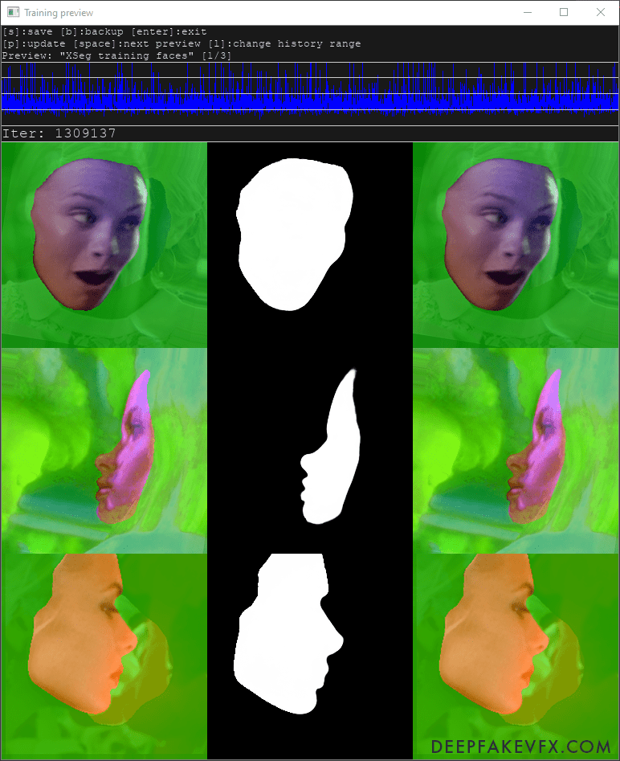

示例：DeepFaceLab 2.0 XSeg Trainer 预览版

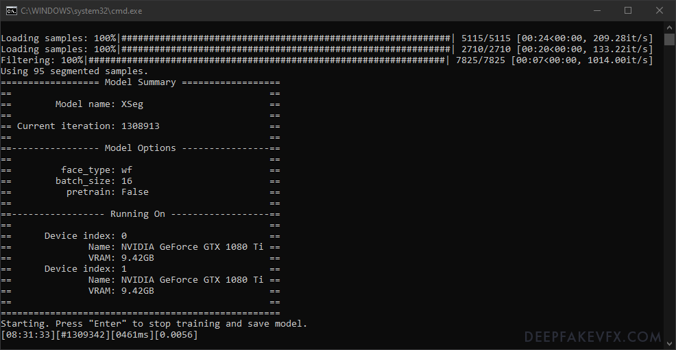

示例：DeepFaceLab 2.0 XSeg Trainer 命令窗口

##### 后续运行

如果您再次启动 XSeg 训练器，您将看到以下选项：

-   Which GPU indexes to choose? 要选择哪些 GPU 索引？：从列表中选择一个或多个 GPU 索引以运行提取。  
    选择多个 GPU 索引时建议使用相同的设备。
-   \[控制台：在 2 秒内按回车键覆盖模型设置。\]

如果按 Enter 键，您将能够更改以下选项：

-   Restart training? 重新开始训练？( y / n )：选择重新开始 XSeg 训练。  
    \[工具提示：重置模型权重并从头开始训练。\]
-   Batch\_size ( 2 – 16 )：选择 XSeg 训练的批大小。  
    \[工具提示：较大的batch size对NN的泛化效果更好，但会导致Out of Memory错误。手动为您的视频卡调整此值。\]
-   Enable pretraining mode 启用预训练模式 (y / n)：选择使用 \_internal/pretrain\_faces 人脸集进行 XSeg 训练。

无法更改模型面类型。

### 应用 XSeg 蒙版

XSeg 蒙版已经过训练，但要使用蒙版，您必须首先将其应用于 faceset 图像。如果您有多个 GPU，则可以使用它们同时应用源人脸集蒙版和目标人脸集蒙版。

##### 运行：5.XSeg) data_dst trained mask apply.bat

-   选择哪个 GPU 索引？：从列表中选择一个 GPU 索引以应用 XSeg 蒙版。

将经过训练的 XSeg 蒙版应用于目标人脸集。需要经过训练的 XSeg 模型。将经过训练的 XSeg 模型文件放在工作区/模型中。

##### 运行：5.XSeg) data_src trained mask apply.bat

-   选择哪个 GPU 索引？：从列表中选择一个 GPU 索引以应用 XSeg 蒙版。

将经过训练的 XSeg 蒙版应用于源人脸集。需要经过训练的 XSeg 模型。将经过训练的 XSeg 模型文件放在工作区/模型中。

应用 XSeg 蒙版后，您可以开始或继续训练 deepfake 模型。但是我建议你先检查应用的面具。打开 XSeg 编辑器，然后按反引号或波浪号键 (\`) 切换应用的蒙版。使用“A”和“D”键滚动图像并在需要的地方创建新的面部标签。再次运行 XSeg trainer，应用 mask，重复该过程，直到应用的 mask 比较干净。

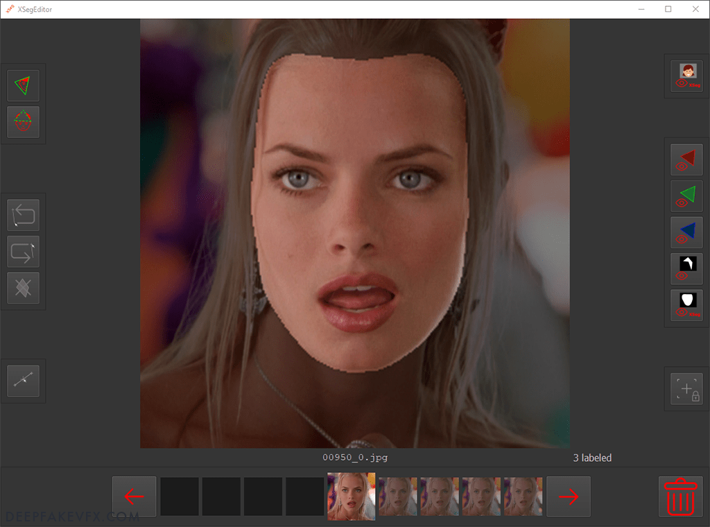

示例：DeepFaceLab 2.0 XSeg Applied Mask

您还可以删除应用的 XSeg 蒙版并返回到默认生成的蒙版，而不会影响您创建的标签。

##### 可选：5.XSeg) data_dst trained mask remove.bat

-   \[安慰： ！！！警告：应用的 XSEG 面具将从框架中移除！！！\]

从目标 faceset 中删除经过训练的 XSeg 蒙版。Faceset 将保留默认生成的蒙版。这不会影响 XSeg 标签。

##### 可选：5.XSeg) data_src trained mask remove.bat

-   \[安慰： ！！！警告：应用的 XSEG 面具将从框架中移除！！！\]

从源人脸集中删除训练有素的 XSeg 蒙版。Faceset 将保留默认生成的蒙版。这不会影响 XSeg 标签。

### 使用 XSeg 蒙版进行训练和合并

当您使用 XSeg 蒙版训练 deepfake 模型时，您会注意到人脸训练区域符合新的蒙版形状。如果您从以前的面具继续训练，那么模型将需要一些时间来适应。在训练预览窗口中，您将看到您应用的 XSeg 蒙版和预测蒙版的预览。预测蒙版基于源蒙版，将用于训练实际的 deepfake（预测）人脸。随着时间的推移，这个预测的蒙版也将适应 XSeg 蒙版。

完成训练后，您还可以在合并过程中使用 XSeg 蒙版。在合并期间使用 XSeg 蒙版模式需要在 /model 文件夹中训练有素的 XSeg 模型。您应该训练模型，直到蒙版边缘定义明确并且在各个人脸集中保持一致。

___

___

## 第 6 步：Deepfake 模型训练

现在是时候开始训练 deepfake 模型了。这显然是 deepfake 过程中最重要的部分，您必须在开始之前做出几个关键决定。决定您的模型设置的主要因素是：可用的硬件、所需的质量和真实性，以及您可以投入训练的时间量。您可能需要尝试许多不同的设置，直到您生成可以在您的系统上以合理速度运行的模型。

训练开始后，某些设置将无法更改。您需要预先选择模型类型和训练器、模型架构和变体以及编码器/解码器维度。由于有多个培训阶段和步骤，因此可以而且应该在整个过程中更改某些选项。此外，某些 DeepFaceLab 进程可能会覆盖某些选项，例如在模型预训练期间。

其他用户的建议请参考[DeepFaceLab 2.0 模型训练设置表](https://www.deepfakevfx.com/guides/model-training-settings/)。

### 模特和教练

有 3 种不同的模型/训练器可供选择：Quick96、SAEHD 和 AMP。

<table><tbody><tr><td>Quick96</td><td>预定义模型；对测试有用。DF-UD，全脸，Resolution 分辨率：96，Batch size：4</td></tr><tr><td>SAEHD</td><td>Sparse Auto Encoder HD。大多数 deepfakes 的标准模型和培训。</td></tr><tr><td>AMP</td><td>Amplifier 放大器。目的地面部表情被放大到源。</td></tr></tbody></table>

DeepFaceLab 2.0 模型训练器

### 架构和变体

有 2 种架构和 4 种变体可供选择。使用 SAEHD，您可以选择任一架构和 0-4 变体的任意组合。Quick96 明确使用 DF-UD 架构。AMP 明确使用自己的架构。每种模型类型、架构和选项都会对系统性能产生独特的影响，从而影响训练速度和结果质量。

| 架构 | 描述 |
| --- | --- |
| DF | 没有变形的严格面部解释。最准确和真实的源数据。 当源和目标具有相似形状的面和颜色时效果最佳。 面部特征（眼睛、嘴巴、鼻子等）的位置在源和目的地之间可能不同。 正面镜头效果更好；配置文件上的结果可能更糟。 源 faceset 必须充分覆盖目标俯仰、偏航和颜色范围。 |
| LIAE | 带有一些变形的宽大面部解释。更适应目标面。 将适应不同形状和颜色的面孔。 面部特征的放置可能会略微变形以适合目标面部。 在极端角度和缺失数据上可能会得到更好的结果。 目标颜色和照明条件的更多复制。 |
| ||

DeepFaceLab 2.0 模型架构

| 变体 | 描述 |
| --- | --- |
| U | 增加与源人脸的相似度。需要更多显存。 |
| D | 通过使用相同的计算成本有效地将分辨率提高一倍来提高性能。 需要更长时间的训练，建议使用预训练模型。 分辨率必须更改为 32 的倍数（其他变体：16）。 |
| T | 增加与源人脸的相似度。 |
| C | （实验性）将激活函数设置为 Leaky ReLu（默认值：ReLu）。 |

DeepFaceLab 2.0 模型架构变体

您将通过键入体系结构名称、后跟连字符和变体选项（例如 df、liae、df-ud、liae-udt）来输入模型体系结构。

### 自动编码器和Dimensions (Dims)

> 自动编码器是一种神经网络架构，能够发现 \[未标记\] 数据中的结构，以便开发输入的压缩表示。自动编码器是一种无监督学习技术，我们利用神经网络来完成表示学习的任务。
> 
> \-Jeremy Jordan，自动编码器[简介](https://www.jeremyjordan.me/autoencoders/)

自动编码器、解码器和编码器值控制模型的神经网络维度，直接影响模型学习人脸的能力。

| DIM | 描述 |
| --- | --- |
| Auto Encoder Dims | Auto encoder dimensions。影响模型学习人脸的整体能力。 |
| Inter Dims | Inter Dims (AMP)。影响模型学习人脸的整体能力。设置为等于或高于Auto Encoder dims。 |
| Encoder Dims | Encoder dimensions。影响编码器（输入）提取人脸的能力。 |
| Decoder Dims | Decoder dimensions。影响解码器（输出）重新创建人脸的能力。 |
| Decoder Mask Dims | Decoder mask dimensions。影响学习蒙版的质量；可能会影响训练。 |

DeepFaceLab 2.0 自动编码器/编码器/解码器尺寸说明

所有编码器和解码器的尺寸都应该改变，这意味着如果你提高或降低 AE Dims，你也应该提高或降低 E 和 D Dims。解码器蒙版Dims决定了学习蒙版的质量，如果您愿意，可以独立更改。Inter Dims 仅用于 AMP 模型。一般来说，更高分辨率的模型需要更高的维度。

### 批量大小

批量大小是 DeepFaceLab 中最重要的选项之一，因为它决定了一次（每次迭代）可以处理的图像数量。更高的批大小将导致更好的模型泛化和更快的训练（更少的迭代）。非常小的批大小 (<=4) 会慢得多，并且模型可能无法概括面部特征、颜色等。非常大的批大小最终可能会导致性能回报减少，并且创建者之间存在关于“最佳批量大小”。建议您达到至少 4 的批量大小，最好在 8-16 范围内。

批量大小可以随时更改，并且有多种模型选项会使用或多或少的系统资源，从而迫使您更改批量大小。此外，如果您选择使用预训练模型，您可能需要更改批量大小以在您的硬件上工作。您可以下载在功能更强大的系统上生成的预训练模型，降低批量大小，并使用您自己的图像进行训练。

### 模型训练设置

其他用户的建议请参考[DeepFaceLab 2.0 模型训练设置表](https://www.deepfakevfx.com/guides/model-training-settings/)。

##### 所有模型训练设置和选项 (SAEHD)

| 训练设置 | 描述 |
| --- | --- |
| Autobackup every N hour 每 N 小时自动备份一次 ( 0 – 24 ) | 设置自动备份间隔。\[工具提示：自动备份模型文件，每 N 小时预览一次。最新备份位于 model/<>\_autobackups/01\] |
| Write preview history 写入预览历史记录 ( y / n ) | 选择写入预览图像历史记录（每 30 次迭代）。\[工具提示：预览历史记录将被写入 \_history 文件夹。\] |
| Choose image for the preview history 为预览历史选择图像（ y / n ） | （条件：写入预览历史）当训练开始时，系统会提示您选择预览图像以生成历史。 |
| Target iteration 目标迭代 | 将目标迭代设置为结束并保存训练。设置为 0 表示不间断训练。 |
| Flip SRC faces randomly 随机翻转 SRC 面 ( y / n ) | \[工具提示：随机水平翻转 SRC faceset。涵盖更多角度，但脸部可能看起来不那么自然。\] |
| Flip DST faces randomly  随机翻转 DST 面 ( y / n ) | \[工具提示：随机水平翻转 DST 人脸集。如果未启用 src 随机翻转，则使 src->dst 的泛化更好。\] |
| Batch size 批量大小 | \[工具提示：较大的batch size对NN的泛化效果更好，但会导致Out of Memory错误。手动为您的视频卡调整此值。\] |
| Resolution 分辨率 (64 – 640) | （已修复）\[工具提示：更高的分辨率需要更多的 VRAM 和时间来训练。\-d archi 的值将调整为 16 和 32 的倍数。\] |
| Face type 脸型（h / mf / f / wf / head） | （已修复）\[工具提示：半脸/中脸/全脸/全脸/头部。半脸具有更好的分辨率，但覆盖的脸颊区域较少。中脸比半脸宽 30%。“全脸”覆盖整个面部区域，包括前额。'head' 覆盖全头，但需要 XSeg 用于 src 和 dst faceset。\] |
| AE architecture AE架构 | （已修复）\[工具提示：“df”保留更多身份保留的面孔。'liae' 可以修复过度不同的脸型。'-u' 增加了脸部的相似度。'-d'（实验性）使用相同的计算成本将分辨率加倍。示例：df、liae、df-d、df-ud、liae-ud、……\] |
| AutoEncoder dimensions 自动编码器尺寸 (32 – 1024) | （已修复）\[工具提示：所有面部信息都将打包到 AE dims中。如果 AE dims的量不够，则例如闭眼将无法识别。更多的dims更好，但需要更多的 VRAM。您可以微调模型大小以适合您的 GPU。\] |
| Encoder dimensions 编码器尺寸 (16 – 256) | （已修复）\[工具提示：更多的暗淡有助于识别更多的面部特征并获得更清晰的结果，但需要更多的 VRAM。您可以微调模型大小以适合您的 GPU。\] |
| Decoder dimensions 解码器尺寸 (16 – 256) | （已修复）\[工具提示：更多的暗淡有助于识别更多的面部特征并获得更清晰的结果，但需要更多的 VRAM。您可以微调模型大小以适合您的 GPU。\] |
| Decoder mask dimensions 解码器蒙版尺寸（16 - 256） | （已修复）[ 工具提示：典型蒙版尺寸 = 解码器尺寸 / 3。如果您手动从 dst 蒙版中切出障碍物，则可以增加此参数以获得更好的质量。\] |
| Masked training 蒙版训练 ( y / n ) | （条件：面部类型 wf 或 head）\[工具提示：此选项仅适用于“whole\_face”或“head”类型。蒙版训练将训练区域剪辑为 full\_face 蒙版或 XSeg 蒙版，因此网络将正确训练人脸。\] |
| Eyes and mouth priority 眼睛和嘴巴优先（y / n） | \[工具提示：帮助解决训练过程中的眼部问题，例如“外星人的眼睛”和错误的眼睛方向。也使牙齿的细节更高。\] |
| Uniform yaw distribution of samples 样本的均匀偏航分布 ( y / n ) | \[工具提示：有助于修复由于人脸集中的少量侧面而导致的模糊侧面。\] |
| Blur out mask 模糊遮罩 ( y / n ) | \[工具提示：模糊训练样本应用面罩之外的附近区域。结果是脸部附近的背景变得平滑，并且在交换的脸部上不太明显。src 和 dst faceset 中的确切 xseg 蒙版是必需的。\] |
| Place models and optimizer on GPU 在 GPU 上放置模型和优化器 ( y / n ) | \[工具提示：当您在一个 GPU 上进行训练时，默认情况下，模型和优化器的权重会放在 GPU 上以加速该过程。您可以将它们放在 CPU 上以释放额外的 VRAM，从而设置更大的尺寸。\] |
| ||
| Use AdaBelief optimizer 使用 AdaBelief 优化器？(是/否) | \[工具提示：使用 AdaBelief 优化器。它需要更多的 VRAM，但模型的准确性和泛化性更高。\] |
| Use learning rate dropout 使用学习率 dropout ( n / y / cpu ) | \[工具提示：当面部训练足够时，您可以启用此选项以获得额外的清晰度并减少亚像素抖动以减少迭代次数。在禁用随机扭曲之前和 GAN 之前启用它。n——禁用。y – 启用.cpu – 在 CPU 上启用。这允许不使用额外的 VRAM，牺牲 20% 的迭代时间。\] |
| Enable random warp of samples 启用样本的随机扭曲（ y / n ） | \[工具提示：需要随机扭曲来概括两张脸的面部表情。当面部经过足够训练时，您可以禁用它以获得额外的清晰度并减少亚像素抖动以减少迭代次数。\] |
| Random hue/saturation/light intensity 随机色调/饱和度/光强度（0.0 - 0.3） | \[工具提示：随机色调/饱和度/光强度仅在神经网络的输入处应用于 src 人脸集。在面部交换期间稳定颜色扰动。通过选择 src faceset 中最近的一个来降低颜色传输的质量。因此，src faceset 必须足够多样化。典型精细值为 0.05\] |
| GAN power GAN 强度 (0.0 – 5.0) | \[工具提示：强制神经网络学习面部的小细节。仅当使用 lr\_dropout(on) 和 random\_warp(off) 对面部进行足够训练时才启用它，并且不要禁用它。值越高，出现伪影的机会就越高。典型的精细值为 0.1\] |
| GAN patch size GAN 补丁大小 (3 – 640) | （条件：GAN power）[ 工具提示：patch size 越大，质量越高，需要的 VRAM 越多。即使在最低设置下，您也可以获得更清晰的边缘。典型的精细值是分辨率/8。\] |
| GAN dimensions GAN 尺寸 (4 – 512) | （条件：GAN 强度）\[工具提示：GAN 网络的维度。尺寸越高，需要的 VRAM 就越多。即使在最低设置下，您也可以获得更清晰的边缘。典型的罚款值为 16。\] |
| ‘True face’ power。( 0.0000 – 1.0 ) | （条件：DF 架构）\[工具提示：实验选项。判别结果面更像 src 面。更高的价值——更强的辨别力。典型值为 0.01。比较 - https://i.imgur.com/czScS9q.png\] |
| Face style power（0.0 - 100.0） | \[工具提示：学习预测人脸的颜色与 mask 内的 dst 相同。如果您想将此选项与“whole\_face”一起使用，您必须使用 XSeg 训练的蒙版。警告：仅在 10k 次迭代后启用它，当预测的面部足够清晰以开始学习风格时。从 0.001 值开始并检查历史更改。启用此选项会增加模型崩溃的机会。\] |
| Background style power（0.0 - 100.0） | 【工具提示：学习预测人脸mask外的区域与dst相同。如果您想将此选项与“whole\_face”一起使用，您必须使用 XSeg 训练的蒙版。对于 Whole\_face，您必须使用 XSeg 训练的蒙版。这可以让 face 更像 dst。启用此选项会增加模型崩溃的机会。典型值为 2.0\] |
| Color transfer for src faceset（ none / rct / lct / mkl / idt / sot ） | \[工具提示：将 src 样本的颜色分布更改为接近 dst 样本。尝试所有模式以找到最佳模式。\] |
| Enable gradient clipping 启用渐变裁剪 ( y / n ) | \[工具提示：梯度裁剪减少了模型崩溃的机会，牺牲了训练速度。\] |
| Enable pretraining mode 启用预训练模式 ( y / n ) | \[工具提示：预训练具有大量各种面孔的模型。之后，模型可以用于更快地训练。强制 random\_warp=N，random\_flips=Y，gan\_power=0.0，lr\_dropout=N，styles=0.0，uniform\_yaw=Y\] |
| ||

DeepFaceLab 2.0 模型训练设置 (SAEHD)

### 预训练和使用预训练模型

您可以预训练模型以从各种面孔中学习面部特征和颜色。然后，可以使用此预训练模型启动任何具有相同核心模型设置的 deepfake。DeepFaceLab 包括[Flickr Faces HQ (FFHQ)](https://github.com/NVlabs/ffhq-dataset)预训练人脸集，其中通用预训练全脸蒙版已应用于对齐图像。旧版本的 DFL 使用[CelebA 数据集](http://mmlab.ie.cuhk.edu.hk/projects/CelebA.html). 您可以在标记为 \_internal/pretrain\_faces 的文件夹中找到当前图像作为 faceset.pak 文件。通过将文件复制到 data\_src/aligned 并运行文件来查看 faceset 4.2) data\_src util faceset unpack.bat。您可以通过运行文件 4.2) data\_src util faceset pack.bat 并将结果 faceset.pak 文件移动到 \_internal/pretrain\_faces 文件夹中，从 data\_src/aligned 文件夹中的图像创建自己的预训练 faceset。

DeepFaceLab 2.0 预训练 Faceset (FFHQ)

当您将预训练模型下载或导入到工作空间/模型文件夹时，您将无法更改核心模型设置，例如面类型、架构和尺寸。如果模型无法在您的系统上运行，那么您应该降低批量大小并考虑增加页面文件大小。如果模型成功加载，那么您可以考虑提高批量大小。此时，您可以继续预训练或禁用预训练模式以开始对您的 faceset 进行正常训练。

下载[DeepFaceLab 预训练模型](https://www.deepfakevfx.com/downloads/pretrained-models/)以加速您的 deepfake 训练。

启用预训练时，DeepFaceLab 将覆盖一些模型设置。

| 设置名称 | 覆盖值 |
| --- | --- |
| Learning Rate Dropout | False |
| Random Warp 随机扭曲 | False |
| GAN | 0.0 |
| Random HSV Power | 0.0 |
| Face Style Power | 0.0 |
| Background Style Power | 0.0 |
| Uniform Yaw 均匀偏航 | True |
| Flip SRC faces randomly | True |
| Flip DST faces randomly | True |

DeepFaceLab 2.0 预训练覆盖值

### 训练 Deepfake 模型

##### 本节正在审查中

##### 运行：6) train (AMP/Quick96/SAEHD)

该软件将加载所有人脸集并尝试运行第一次训练迭代。如果成功，则会打开训练预览窗口。如果训练器无法运行，则需要调整模型设置或[优化系统](https://www.deepfakevfx.com/guides/deepfacelab-2-0-guide/#system-optimization)。

命令窗口将显示当前模型设置和硬件的列表。下面是当前时间、当前迭代（周期）计数、处理当前迭代的时间、源损失值和目标损失值。这些损失值代表了训练的准确性，并且随着时间的推移将接近零，因此值越低，结果越好。随着培训的进行，这些数字将不断更新。如果数字停止更新，则意味着培训师已冻结并且可能会崩溃。

花点时间查看预览窗口。顶部是一些键盘命令。下面是损失值随时间变化的图表，以及训练图像的预览。

按 P 键更新预览窗口并注意图形和图像的变化。这些线代表损失值（准确性），因此线越低，结果越好。图像预览有几列显示正在处理的源图像和目标图像以及蒙版，以及预测的 deepfake 人脸。您将使用此预览窗口来决定何时结束培训。按 Enter 保存模型并退出。

##### 模型训练工作流程 (SAEHD)

-   第 1 阶段：预训练（可选）
    -   第 1 步 – 预训练模型或导入预训练模型。
        -   输入所有模型设置。
        -   启用预训练模式。
-   第 2 阶段：泛化/扭曲训练
    -   第 2 步 - 随机扭曲
        -   启用样本的随机扭曲
        -   启用蒙版训练（仅限 WF/Head）
        -   禁用预训练模式。
            -   （可选）启用随机翻转 SRC 面、随机翻转 DST 面、src faceset 的颜色传输
            -   （可选）在变形阶段添加或删除面部图像并更改蒙版
            -   （可选）根据需要启用渐变剪裁
    -   第 3 步 - 眼睛和嘴巴优先（可选）
        -   启用眼睛和嘴巴优先
    -   第 4 步 - 均匀偏航（可选）
        -   禁用眼睛和嘴巴优先
        -   启用样本的均匀偏航分布
    -   第 5 步 - 学习率丢失（可选）
        -   启用使用学习率辍学
            -   （可选）禁用样本的均匀偏航分布
-   第 3 阶段：标准化/定期培训
    
    -   第 6 步 – 定期培训
        -   禁用随机扭曲
        -   禁用统一偏航
        -   禁用眼睛和嘴巴优先
        -   禁用使用学习率丢失
    -   第 7 步 - 样式和颜色（可选）
        -   启用模糊遮罩、“真脸”功能（仅限 DF）、面部样式功能、背景样式功能、（随机色调/饱和度/光强度？）
    -   第 8 步 – 眼睛和嘴巴优先（可选）
        -   启用眼睛和嘴巴优先
    
    -   第 9 步：均匀偏航（可选）
        -   禁用眼睛和嘴巴优先
        -   启用样本的均匀偏航分布
    -   第 10 步 – LRD（可选）
        -   启用使用学习率辍学
        -   禁用眼睛和嘴巴优先
            -   （可选）禁用样本的均匀偏航分布
-   第 4 阶段：增强/GAN 训练（可选）
    -   第 11 步 - GAN
        -   禁用眼睛和嘴巴优先
        -   禁用样本的均匀偏航分布
        -   设置 GAN 强度
        -   设置 GAN 补丁大小
        -   设置 GAN 维度

___

## 步骤 6.1：导出为 DeepFaceLive 的 DFM

将 deepfake 模型导出为 .dfm 格式以在[DeepFaceLive](https://github.com/iperov/DeepFaceLive)中工作。有关说明，请参阅[DeepFaceLive 用户常见问题解答](https://github.com/iperov/DeepFaceLive/blob/master/doc/user_faq/user_faq.md)。

##### 如果您不使用 DeepFaceLive，请跳过此步骤。

##### 运行：6) export AMP as dfm.bat 或 6) export SAEHD as dfm.bat

将 AMP 或 SAEHD 模型导出为 .dfm 格式以在 DeepFaceLive 中工作。

-   选择一个已保存的模型，或输入名称以创建新模型。  
    \[ r \] : 重命名  
    \[ d \] : 删除  
    \[注意：选择模型索引导出为 dfm。\]
-   xport quantized 输出量化？( y / n )：量化会降低精度，但会导致模型尺寸更小，计算速度更快。阅读更多关于[TensorFlow 优化](https://www.tensorflow.org/lite/performance/model_optimization)的信息。  
    \[工具提示：使导出的模型更快。如果您有问题，请禁用此选项。\]

___

___

## 第 7 步：合并 Deepfake 模型以构建图像

现在训练已经完成，您可以合并人脸并创建最终的 deepfake 帧图像。

##### 运行：7）merge (AMP/Quick96/SAEHD)

-   Choose one of saved models, or enter a name to create a new model.选择一个已保存的模型，或输入名称以创建新模型。  
    \[ r \] ：重命名  
    \[ d \] ：删除  
    \[注意：按索引选择模型进行合并。\]
-   Choose one or several GPU idxs (separated by comma).选择一个或多个 GPU idx（以逗号分隔）。  
    从列表中选择一个或多个 GPU 索引以运行提取。  
    选择多个 GPU 索引时建议使用相同的设备。

模型将初始化，命令窗口将显示当前模型摘要。

-   Use interactive merger 使用交互式合并？( y / n )：选择是否要使用交互式（视觉预览）合并。  
    非交互模式没有预览窗口。
-   Number of workers 线程数？(1-16)：指定进程数。  
    \[工具提示：指定要处理的线程数。较低的值可能会影响性能。较高的值可能会导致内存错误。该值不得大于 CPU 内核数。\]

将收集图像对齐并计算运动矢量。

-   Use saved session 使用保存的会话？( y / n ) ：如果您已经使用了合并，您可以使用保存的设置继续。

交互模式显示键盘输入图、合并图像的视觉预览，并显示当前帧号和设置。您将能够更改每个单独帧的设置。您可以保存会话并稍后继续。

在非交互模式下，系统会提示您按顺序输入所有值。之后，系统将提示您输入工人数量。所有的帧都将被处理；您无法更改每帧的设置。您将无法保存或加载会话。

### Interactive Merger 互动合并

在交互模式下，合并窗口将打开并显示键盘输入图，而命令窗口将显示当前帧号和设置 (config/cfg)。选择键盘映射窗口后，按 Tab 键在键盘映射和图像预览之间切换。如果您看到黑色方形预览，或者您的第一帧没有人脸，只需使用 < and > 键滚动到第一帧或人脸。您会注意到命令窗口中显示的当前帧号和设置。

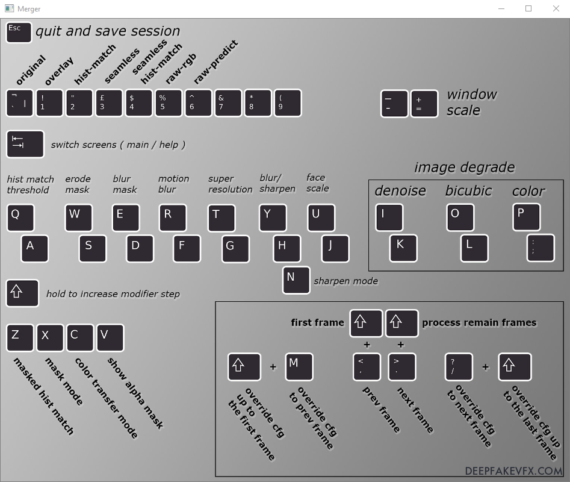

图：DeepFaceLab 2.0 合并键盘输入

当您更改模式和修饰符时，您将看到命令窗口中显示的值。

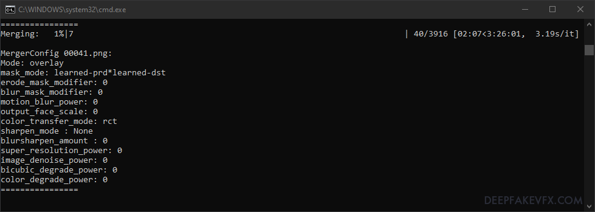

示例：DeepFaceLab 2.0 合并命令窗口

为了导航框架并更改设置，您需要打开图像预览窗口（Tab）。

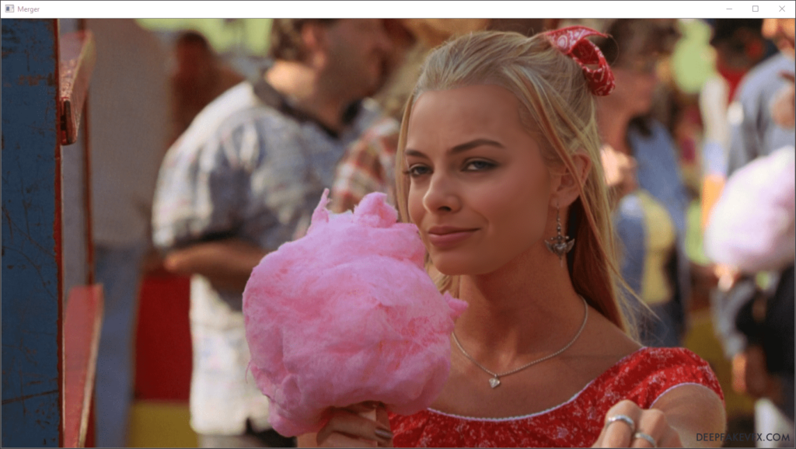

示例：DeepFaceLab 2.0 合并预览窗口

##### 帧导航和处理命令

最简单的合并将涉及 3 个步骤：

1.  在第一帧更改模式和修改器
2.  将设置 (config/cfg) 覆盖到最后一帧 \[Shift + /\]
3.  处理剩余帧 \[Shift + >\]

中间级别的合并将更改模式和修改器，覆盖最后一帧，然后前进到下一个镜头或场景，更改和覆盖配置，并为视频中的每个不同镜头或场景重复该过程。

高级合并是通过在演员或摄像机移动或照明变化时更改设置来“即时”修改配置。您可能还想专门在包含障碍物的框架上修改配置。请记住，DeepFaceLab 合并没有关键帧功能，这意味着帧之间没有补间或插值。

| 导航/流程 | 键盘输入 |
| --- | --- |
| 退出并保存会话 | Esc键 |
| 切换屏幕（主/帮助） | Tab |
| 窗口比例（下） | – |
| 窗口比例（上） | + |
| 上一帧 | < |
| 下一帧 | \> |
| 第一帧 | Shift + < |
| 处理剩余帧 | Shift + > |
| 将 cfg 覆盖到上一帧 | M |
| 将 cfg 覆盖到下一帧 | / |
| 覆盖 cfg 直到第一帧 | Shift + M |
| 覆盖 cfg 直到最后一帧 | Shift + / |
| 显示 Alpha 蒙版 | V |

DeepFaceLab 2.0 合并导航

##### 叠加模式

覆盖模式 \[\`,1-6\] 确定预测的面部将如何覆盖（分层）到目标图像上。

| 叠加模式 | 描述 |
| --- | --- |
| \[\`\] Original | 没有叠加。显示原始目标帧图像。 |
| \[1\] Overlay 叠加 | 简单的叠加。 |
| \[2\] Hist-Match | 使用直方图匹配叠加。启用“历史匹配阈值”\[Q/A\]。切换蒙版/未蒙版模式 \[Z\] |
| \[3\]  Seamless 无缝 | 使用 OpenCV Poisson 无缝克隆来融合人脸 |
| \[4\] Seamless Hist-Match 无缝直方图匹配 | 无缝和历史匹配的组合。启用“历史匹配阈值”\[Q/A\]。 |
| \[5\] Raw-RGB | 覆盖整个学习的面部区域（正方形），没有蒙版 |
| \[6\] Raw-Predicted | 仅导出预测的（学习的）人脸。像 faceset 一样的方形图像。 |

DeepFaceLab 2.0 合并叠加模式

##### 蒙版模式

蒙版模式 (X) 可让您选择要使用的蒙版形状。您可以使用 Show Alpha Mask (V) 切换遮罩覆盖视图。

| 蒙版模式\[X\] | 描述 |
| --- | --- |
| dst | 默认生成的目标蒙版 |
| learned-prd | 训练过程中基于源学习的蒙版 |
| learned-dst | 训练期间根据目的地学习的蒙版 |
| learned-prd*learned-dst | 使用最小区域的组合学习蒙版 |
| learned-prd+learned-dst | 使用最大面积的组合学习蒙版 |
| XSeg-prd | 基于源的 XSeg 蒙版（需要 XSeg 模型） |
| XSeg-dst | 基于目的地的 XSeg 蒙版（需要 XSeg 模型） |
| XSeg-prd\*XSeg-dst | 使用最小面积的组合 XSeg 蒙版（需要 XSeg 模型） |
| learned-prd***learned-dst*XSeg-prd*XSeg-dst | 使用最小面积的组合蒙版（需要 XSeg 模型） |
| full | 蒙版延伸到人脸边界（正方形）。类似于不戴口罩。 |

DeepFaceLab 2.0 合并蒙版模式

##### 颜色转移模式

颜色传输模式 \[C\] 会将颜色从目标面传输到预测面。

| 颜色转移模式\[C\] | 描述 |
| --- | --- |
| None | 无颜色转移 |
| rct | [莱因哈德颜色转移](https://www.cs.tau.ac.il/~turkel/imagepapers/ColorTransfer.pdf)（蒙版） |
| lct | 线性颜色转移（线性变换） |
| MKL | [蒙格-坎托罗维奇线性](https://www.researchgate.net/publication/4317833_The_linear_Monge-Kantorovitch_colour_mapping_for_example-based_colour_transfer) |
| mkl-m | MKL 蒙面 |
| idt | [迭代分布转移](https://citeseerx.ist.psu.edu/viewdoc/download?doi=10.1.1.458.7694&rep=rep1&type=pdf) |
| idt-m | IDT 屏蔽 |
| sot-m | [切片最优传输](https://dcoeurjo.github.io/OTColorTransfer/)蒙版 |
| mix-m | RCT/LCT/SOT 混合蒙版 (?) |

DeepFaceLab 2.0 合并颜色传输模式

##### 所有合并模式和修改器

| 合并模式和过滤器 | 描述 |
| --- | --- |
| \[\`,1-6\] 模式 | 图像叠加模式。 |
| \[Z\] Masked Hist-Match 蒙面历史匹配 | 屏蔽或未屏蔽直方图匹配。 |
| \[Q,A\] His-Match Threshold | 直方图匹配阈值。 |
| \[W,S\] Erode Mask Modifier 侵蚀蒙版修改器 | 扩大或缩小蒙版区域。 |
| \[E,D\] Blur Mask Modifier 模糊蒙版修改器 | 羽化遮罩边缘。 |
| \[R,F\] Motion Blur Power 运动模糊能力 | 运动模糊能力。每帧只能有一张脸。 |
| \[U,J\] Output Face Scale 输出人脸比例 | 放大或缩小脸部的大小。 |
| \[C\] Color Transfer Mode 色彩转移模式 | 将颜色转移到脸上。 |
| \[N\] Sharpen Mode 锐化模式 | 选择锐化模式。 |
| \[Y,H\] Blur/Sharpen Amount 模糊/锐化量 | 模糊或锐化面部。 |
| \[T,G\] Super Resolution Power 超强解析力 | 设置超分辨能力 |
| \[I,K\] Image Denoise Power 图像去噪 | 设置图像去噪强度 |
| \[O,L\] Bicubic Degrade Power | 设置双三次降级强度。 |
| \[P,;\] Color Degrade Power 颜色退化 | 设置颜色退化强度。 |

DeepFaceLab 2.0 合并模式和修改器

### 非交互式合并

在非交互模式下，系统会提示您按顺序输入所有值。之后，系统将提示您输入工人数量。所有的帧都将被处理；您无法更改每帧的设置。您将无法保存或加载会话。

-   选择模式：
    -   (0) original 原创
    -   (1) overlay 叠加
    -   (2) hist-match 直方图匹配
    -   (3) seamless无缝
    -   (4)  seamless-hist-match 无缝匹配
    -   (5) raw-rgb
    -   (6) raw-predict
-   （有条件的）蒙版的直方图匹配？（是/否）：
-   （有条件的）直方图匹配阈值（0..255）：
-   选择蒙版模式：
    -   (0) full
    -   (1) dst
    -   (2)learned-prd
    -   (3)learned-dst
    -   (4) learned-prd*learned-dst
    -   (5) learned-prd+learned-dst
    -   (6) XSeg-prd
    -   (7) XSeg-dst
    -   (8) XSeg-prd\*XSeg-dst
    -   (9)learned-prd\*learned-dst\*XSeg-prd\*XSeg-dst

-   选择侵蚀蒙版修改器（-400..400）：
-   选择模糊蒙版修改器（0..400）：
-   选择运动模糊强度（0..100）：
-   Use two pass mode 使用双通模式？（是/否？：帮助）：
-   选择 pre\_sharpen 强度（0..100 ?:help）：
-   选择输出面部比例修改器（-50..50）：
-   颜色转移到预测面（rct/lct/mkl/mkl-m/idt/idt-m/sot-m/mix-m）：
-   选择锐化模式：
    -   (0) None
    -   (1) box
    -   (2) gaussian 高斯
-   选择超分辨率（0..100 ?:help）：
-   通过降噪强度选择图像降级（0..500）：
-   通过双三次重新缩放强度（0..100）选择图像降级：
-   降低最终图像的色彩强度（0..100）：

### 导出以进行后处理

您可以在后处理软件中使用合并的图像和蒙版序列作为 DeepFaceLab 合并的替代或补充。

您可能需要这些元素：

-   原始目的视频
-   提取的目标帧
-   合并帧图像序列
-   合并蒙版图像序列

将这些图像序列导入您的编辑或后处理软件。您的软件可能会提供导入图像序列的特定方法，否则请查找文档或教程。然后，您可以使用合并的蒙版图像为合并的帧图像创建遮罩。之后，您应该可以自由修改遮罩、颜色校正和在障碍物上绘制。一些创作者使用多个蒙版、具有不同设置的合并图像序列，甚至多个模型和面部类型来创建高级构图。

___

## 第 8 步：将帧图像合并到视频

整个过程的最后一部分是将新的 deepfake 帧图像合并到带有原始目标音频的视频文件中。

##### 运行：8) merged to *.bat

将最终图像序列合并到目标视频。在工作区文件夹中生成 result.\* 和 result\_mask.\*。

-   Bitrate of output file in MB/s 以 MB/s 为单位的输出文件比特率：选择视频比特率。

合并完成后关闭窗口。

| 合并为视频格式 | 描述 |
| --- | --- |
| 8) merged to avi.bat | 将最终图像序列以 AVI 格式合并到目标视频。以 MB/s 为单位的输出文件比特率：选择视频比特率。在工作区文件夹中生成 result.avi 和 result\_mask.avi。 |
|8) merged to mov lossless.bat  |将最终图像序列作为无损 MOV 合并到目标视频。在工作区文件夹中生成 result.mov 和 result\_mask.mov。|
|8) merged to mp4 lossless.bat |将最终图像序列以无损 MP4 格式合并到目标视频。在工作区文件夹中生成 result.mp4 和 result\_mask.mov。|
|\8) merged to mp4.bat  |将最终图像序列作为压缩 MP4 合并到目标视频。 以 MB/s 为单位的输出文件比特率：选择视频比特率。在工作区文件夹中生成 result.mp4 和 result\_mask.mp4。|
DeepFaceLab 2.0 合并到视频格式

___

## 第 9 步：查看结果视频

最后，您可以观看 deepfake 视频了。导航到工作区文件夹，您将看到一些新文件。

##### 播放标有“result.\*”的文件（例如 result.mp4）。

___